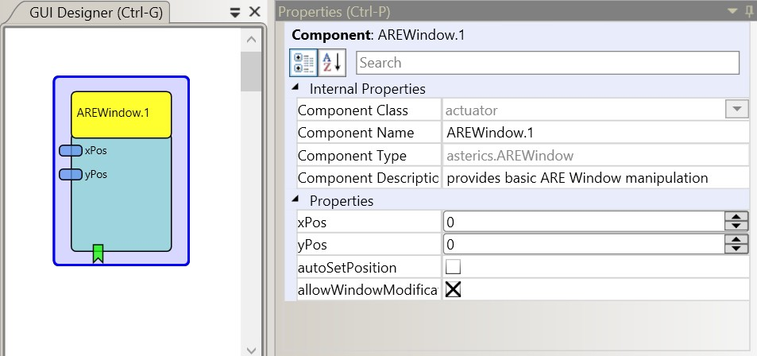

# AREWindow

Component Type: Actuator (Subcategory: Graphical User Interface)

This component allows moving the ARE window to desired locations on the screen and setting its state and modification options. Several default locations can be selected via incoming events (top, left, bottom, right or center of the screen). X- and Y- offset values can be defined - thus it becomes possible to set the ARE window e.g to a second screen (which is currently not supported in the ACS GUI designer).

AREWindow plugin

## Input Port Description

*   **xPos \[integer\]:** The x offest value for positioning the ARE window
*   **yPos \[integer\]:** The y offest value for positioning the ARE window

## Event Listener Description

*   **moveToTop:** moves the ARE window to the top of the screen (y offset will be applied). The x position will not be changed.
*   **moveToBottom:** moves the ARE window to the bottom of the screen (y offset will be applied). The x position will not be changed.
*   **moveToLeft:** moves the ARE window to the left side of the screen (x offset will be applied). The y position will not be changed.
*   **moveToRight:** moves the ARE window to the right side of the screen (x offset will be applied). The y position will not be changed.
*   **moveToCenter:** moves the ARE window to the center of the screen (x and y offsets will be applied).
*   **minimize:** minimizes the ARE window to the taskbar
*   **restore:** restores the ARE window from the taskbar
*   **bringToFront:** places the ARE window on top of other windows

## Properties

*   **xPos \[integer\]:** default value for the x offset
*   **yPos \[integer\]:** default value for the y offset
*   **autoSetPosition \[boolean\]:** if selected, the ARE window position will be modified at startup of the model according to the xPos and yPos properties. Furthermore, incoming values at the xPos or yPos ports will automatically position the ARE window.
*   **allowWindowModification \[boolean\]:** If selected, the user can change the ARE window decoration and control panel by double- or right-clicking into the ARE window. These functions will be disabled when the property is not selected.