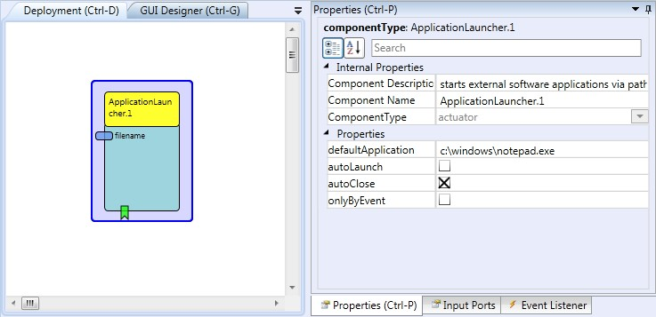

# ApplicationLauncher

### Component Type: Actuator (Subcategory: File System)

The ApplicationLauncher component can be used to run an external executable application.
The application name is given to the plugin via an input port.
A default application can be started via an incoming event.
Togehter with the Keyboard- or RemoteKeyboard components, the ApplicationLauncher plugin can perform complex automation tasks, for example open Skype, choose a contact and make a call.

  
ApplicationLauncher plugin

## Input Port Description

- **filename \[integer\]:** The filename of the application to be started (including path).

## Event Listener Description

- **launchNow:** An incoming event on this port will start the (default or lastest received) application
- **closeNow:** An incoming event on this port will close the current application

## Properties

- **defaultApplication \[string\]:** Full path and filename of the default application
- **arguments \[string\]:** the commandline arguments for the application
- **workingDirectory \[string\]:** the working directory for the application (`.` is used for home directory of the application)
- **autoLaunch \[boolean\]:** Defines if the default application is automatically launched at startup
- **autoClose \[boolean\]:** Defines if the current application is closed when the model is stopped
- **onlyByEvent \[boolean\]:** If this property is set to true, incoming application files names will not be started immediately (only the launchNow event will start the application)
