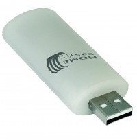
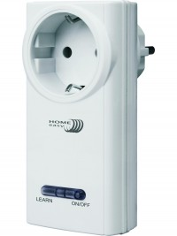
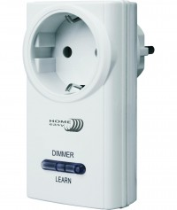

# EasyHomeControl

Component Type: Actuator (Subcategory: Home Control)

With the EasyHomeControl, commands for the EasyHome house automation system can be sent over the PCS device sold by ELV electronics. See [the EasyHome homepage](http://www.elro.eu/de/produkte/cat/home-automation/home-easy-next) for details.

## Requirements

The EasyHome sender must be attached to the system!

Picture of the EasyHome sender

Picture of the EasyHome switch

Picture of the EasyHome dimmer

## Supported OSes

Windows (x86,x64), Linux (x86, x64, arm(Raspberry Pi)), Mac OSX(x86, x64)

## Troubleshooting problems under Win8/Win8.1

Under Windows 8 and Windows 8.1, there can be problems concering the operation of the EasyHome device: If the red control led stays stays dark eaven if a command is send and the EasyHome sender cannot be used, the reason could be that the power management settings on Win8/8.1 switch the device off per default - this can be changed by applying the following steps:

- Open the Device Manager (usually can be selected by right-clicking at the bottom left corner of your windows desktop)
- Open the device group "Human Interface Devices"
- Locate the device which pops up when you insert or remove the EasyHome module to/from an USB port It should be a "HID compliant supplier defined device". You can distinguish different devices by right-clicking a device and looking into rider "details" and "properites" - there you can find the VID and PID values, e.g. under property "last known parent"
- Note the VID and PID values. For example if you see a line like "USB\\VID_1B1F&PID_C00F\\EEE0000473" the values are VID:1B1F and PID:C00F
- Press the Windows-Key and "R" to open the command window. Type "regedit" and press enter
- Select the entry "HKEY_LOCAL_MACHINE" > "SYSTEM" > "CurrentControlSet" > "Enum" > "USB".
- In this list, select the entry for the EasyHome device (given by VID und PID you noted)
- Open the Subfolder "Device Paramteters" and double click the property "EnhancedPowerManagementEnabled" which appears in the right window section
- Change the property value from 1 to 0 and commit by clicking "OK"
- Restart you PC - now hopefully the EasyHome works as intended.

## Udev rules Linux

You must run the ARE as root for being able to access the device. Alternatively you can define a [udev rule](https://github.com/signal11/hidapi/blob/master/udev/99-hid.rules)

## Event Listener Description

See table below for a list of all commands that can be triggered

Command Mapping

Command

ID

OffDevice1-15

0

OnDevice1-15

1

To dim the light you have to sent an on signal when the light is already turned on.

## Properties

- **nameDevice \[string\]:** Set the device name.
- **numberDevice \[integer\]:** Set the number of the device. The number must be the same if the shwitches shoud akt synchronized
