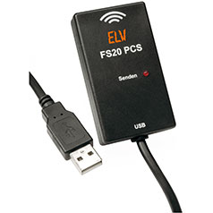

# FS20 Sender

### Component Type: Actuator (Subcategory: Home Control)

With the FS20 Sender commands for the FS20 house automation system can be sent over the PCS device sold by ELV electronics. See [the ELV FS20 homepage](http://www.elv.de/output/controller.aspx?cid=74&detail=10&detail2=29530&flv=1&bereich=&:marke=) for details.

## Requirements

The PCS sender must be attached to the system!

  
Picture of the PCS FS20 sender

## Supported OSes

Windows (x86,x64), Linux (x86, x64, arm(Raspberry Pi)), Mac OSX(x86, x64)

## Troubleshooting problems under Win8/Win8.1

Under Windows 8 and Windows 8.1, there can be problems concering the operation of the FS20 PCS device: If the red control led stays on just a few seconds after plugging in the device, and then goes dark and teh PCS sender cannot be used, the reason could be that the power management settings on Win8/8.1 switch the device off per default - this can be changed by applying the following steps:

- Open the Device Manager (usually can be selected by right-clicking at the bottom left corner of your windows desktop)
- Open the device group "Human Interface Devices"
- Locate the device which pops up when you insert or remove the FS20 PCS module to/from an USB port It should be a "HID compliant supplier defined device". You can distinguish different devices by right-clicking a device and looking into rider "details" and "properites" - there you can find the VID and PID values, e.g. under property "last known parent"
- Note the VID and PID values. For example if you see a line like "USB\\VID_1B1F&PID_C00F\\EEE0000473" the values are VID:1B1F and PID:C00F
- Press the Windows-Key and "R" to open the command window. Type "regedit" and press enter
- Select the entry "HKEY_LOCAL_MACHINE" > "SYSTEM" > "CurrentControlSet" > "Enum" > "USB".
- In this list, select the entry for the FS20 PCS (given by VID und PID you noted)
- Open the Subfolder "Device Paramteters" and double click the property "EnhancedPowerManagementEnabled" which appears in the right window section
- Change the property value from 1 to 0 and commit by clicking "OK"
- Restart you PC - now hopefully the FS20 PCS works as intended.

## Udev rules Linux

You must run the ARE as root for being able to access the device. Alternatively you can define a [udev rule](https://github.com/signal11/hidapi/blob/master/udev/99-hid.rules)

## Input Port Description

- **houseCode \[int\]:** The houseCode to which the command should be sent. Overrides the houseCode set in the properties
- **address \[int\]:** The address of the target device. Overrides the houseCode set in the properties.
- **action \[string\]:** Action input to send commands from other components which output a variable string, for example OSKA. The string format is as follows: @FS20:houseCode,address,command; e.g.@FS20:11111111,1234,18 to send the toggle command to the device with housecode 11111111 and address 1234. The delimiters ',', '\_' and ' ' are allowed. For the indices of the commands see the table below.

## Event Listener Description

See table below for a list of all commands that can be triggered

Command Mapping

Command

ID

Off

0

Level1

1

Leve2

2

Leve3

3

Leve4

4

Leve5

5

Leve6

6

Leve7

7

Leve8

8

Leve9

9

Level10

10

Level11

11

Level12

12

Level13

13

Level14

14

Level15

15

Level16

16

OnOldLevel

17

Toggle

18

Dim Up

19

Dim Down

20

Dim Up and Down

21

Program internal timer

22

Off for timer then old brightness level

24

On for timer then off

25

On old brightness level for timer then off

26

On for timer then old brightness level

30

On for old level then previous state

31

## Properties

- **houseCode \[integer\]:** The default housecode for the component if there is no on the input port.
- **address \[integer\]:** The default address for the component if there is no on the input port.
