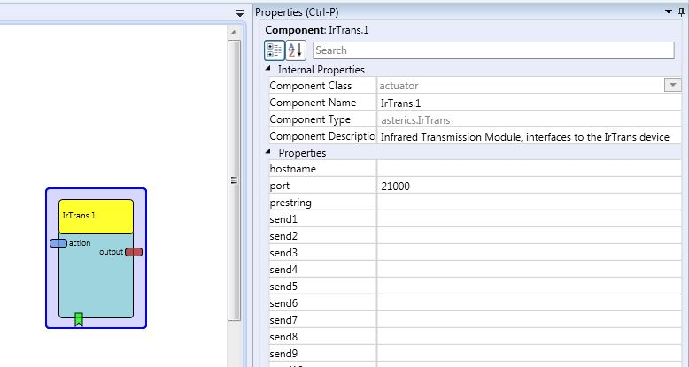
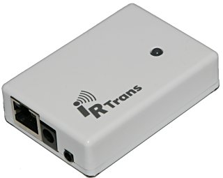

# IR Trans

## Component Type: Actuator (Subcategory: Home Control)

This component sends transmission commands to an infrared-transmitter. The different commands can be selected by the different events. The commands must be programmed into the IR-transmitter, before this component can be used. Furthermore, commands can also be sent to this component's input port ("action").

**Action String example:** The action string starts with "@IRTRANS:" and contains the remote control name and the command name. For example, if the IR-Transmitter is programmed with a database called "LG-TV" and the desired command is called "TvOn", the action string to play the IR-code is "@IRTRANS: snd LG-TV,TvOn".  
  
Using the event based option, the property "prestring" is set to "snd LG-TV", and at property "send1" is set to "TvOn".

IRTrans plugin

## Requirements

The IRTrans module (USB, LAN or WiFi version) is required. It can be purchased from [http://www.irtrans.de][1].

IRTrans universal IR remote module

## Input Port Description

*   **action\[string\]:** A string, which will be sent to the IRTrans module, must start with "@IRTRANS".  
    For possible commands see [official IrTrans protocol guide][2].  
    **Note:** the action string sent to the input port must not contain the prefix "A" like described in the protocol guide. This is because of compatibility reasons with the old UDP protocol.

## Output Port Description

*   **output\[string\]:** The IRTrans can also receive IR-Commands. With the IRTrans Configuration tool string commands can be defined for every received IR-Command. Received IR-commands are sent to this port, e.g. "\*\*00028 RCV\_COM test,on,0,0" (see protocol guide for format details)
*   **outputResult\[string\]:** Receives the result of an action string that was previously sent to action-port.

## Event Listener Description

*   **sendprop1:** sends the command, stored in the property send1 to the IRTrans (including the prestring).
*   ...
*   **sendprop24:** sends the command, stored in the property send24 to the IRTrans (including the prestring).

## Properties

*   **hostname\[string\]:** The hostname/IP-address of the IRTrans. Use "localhost" if you have the IRTrans USB Version (IRTrans server tool must be running), or use the IP address of your IRTrans LAN or WiFi module.
*   **port\[string\]:** The port of the IRTrans (default is 21000).
*   **prestring\[string\]:** A string, being added before the strings of properties send1 to send24. Typically snd or snd , should be used.
*   **Send1\[string\]:** This string (including the prestring) will be sent, if the event EventProp1 will be triggered.
*   ...
*   **Send24\[string\]:** This string (including the prestring) will be sent, if the event EventProp24 will be triggered.

_Comment:_ This component is exactly tailored to the IRTrans module and needs expert knowledge to be configured.

[1]: http://www.irtrans.de
[2]: http://www.irtrans.de/download/Docs/IRTrans%20TCP%20ASCII%20Interface_EN.pdf