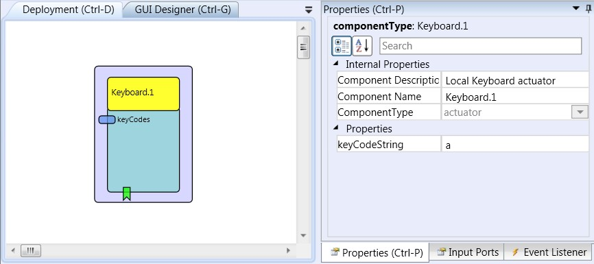

  
---
Keyboard
---

# Keyboard

### Component Type: Actuator (Subcategory: Input Device Emulation)

The Keyboard component generates local keyboard input on the computer that the ARE is running on (per software emulation). The component supports key press/hold/release actions and sending key sequences and special keycodes. special or non-printable characters can be sent using notations like {UP} {ENTER} {ALT} {DELETE} etc. - see description of the property keyCodeString. Multiple instances of the Keyboard component can be used to provide different key actions.

  
Keyboard plugin

## Requirements

No special hardware or software required.

## Input Port Description

*   **keyCodes \[string\]:** An incoming string which consists of alphanumeric characters and special key codes. The keys are sequentially generated as local keystrokes as the string is received, and as the sendKeys and other input related events of the component are being triggered.

## Event Listener Description

*   **sendKeys:** An incoming event at this port generates all keycodes of the keycode string (sequentially).
*   **pressKey:** An incoming event at this port pressed (and releases) the key (first key + modifiers if there are multiple keys).
*   **holdKey:** An incoming event at this port holds the key (first key + modifiers if there are multiple keys). The key is pressed but not released. The holdKey listener can be used together with the releaseKey feature to create long key presses of single keys (e.g. of the cursor keys) to allow game control etc.
*   **releaseKey:** An incoming event at this port releases the key which was pressed using the hold event.

## Properties

*   **keyCodeString \[string\]:** A string containing keys and keycodes. Please note that this string will be replaced by an incoming string at the keycodes input port. The keyCodeString can contain alphanumeric characters and special characters. Special characters are written in parentheses, for example {SHIFT}, {CTRL}, {ALT}, {BACKSPACE}, {ENTER} etc. Modifier keys like {SHIFT} or {ALT} are combined as they appear consecutively in the keystring, and are generated with the next printable character. For example, the keystrings "{SHIFT}" or "{CTRL}{ALT}{DEL}" are sent as single key values to the target computer. For a description of the currently supported special key codes please refer to Appendix B of the user manual.
*   **inputMethod \[integer\]:** Declares whether to use sending window messages (Windows), system-wide SendInput API function (Windows) or JNativehook (cross-platform) as key injection method. (Please note that there are still problems with locales and special key translation...)
*   **waitTime \[integer\]:** Defines a number of milliseconds for a pause which shall occur when {WAIT} appears in the keycode string.