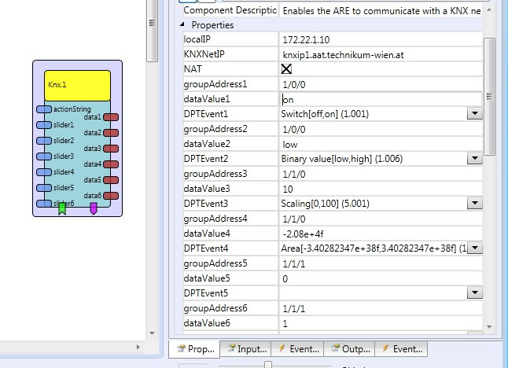

# KNX

## Component Type: actuator (Subcategory: Home Control)

The KNX plugin enables the ARE to interface a KNX installation. This plugin utilizes the calimero java library (http://calimero.sourceforge.net/) for the KNX implementation, it is (C)opyrighted 2006-2008 by W. Kastner and released under the GNU General Public License (FSF v2 or later). The KNX plugin provides an interface to the KNX home automation bus via a KNXnet/IP router. KNX actuators with specific group addresses can be switched on or off, or a specific value can be sent to the KNX actuators. This allows control of lightning, heat and ventilation, blend control or other utilization of other home automation facilities via the AsTeRICS platform.

KNX plugin

## Requirements

*   A KNX infrastructure
*   A little knowledge on KNX

## Functional Description

By starting the model, the KNX plugin establishes a connection to the KNX gateway specified by the plugin properties. Currently, this plugin supports only IP connection (due to the limitation of the underlaying calimero library, USB interfaces will be supported with Java8). The plugin has three different possibilities to interface KNX datapoints:

*   Transmitting: Input ports (slider): Intended for dimming actuators
*   Transmitting: Event Listeners: Used to send a defined value (with a given type) to a KNX group address.
*   Transmitting: Action string: The most flexible way to send something to KNX. The command structure is: _@KNX: group\_address,datapoint\_type,value_. It is possible to use either a space, a comma or a number sign as separation tokens. The datapoint type is described later.
*   Receiving: Event Triggers: An event trigger can be used to listen to a defined KNX group address. If there is ANYTHING happening on this dedicated group address, an event will be raised.
*   Receiving: Output ports: The received value of a KNX group address will be interpreted by the given data point type, parsed to a string and sent out to the output ports

## KNX datapoint types

KNX itself doesn't provide any possibilty to get information on how to interpret received data. This is the point where you need the datapoint types. There are a few main types and some sub types. For example: _1.001_ is the datapoint type for a simple switch actuator/sensor. The input values are varying on the different datapoint types. For the switch example, the valid values are _on_ and _off_. The full list of all datatypes is provided by the ARE. If you want to receive a full list, you have to place the plugin in your ACS model, connect to the ARE and upload the model (even without any functionality). Afterwards, the full list of all currently supported datapoint types is available. Every list entry contains following information:

*   Description
*   \[Minimum,Maximum value\]
*   (Datapoint ID)

The example of the light switch:  
_Switch\[off,on\] (1.001)_ The literal name for this datapoint type is "Switch" and its ID is 1.001. Because this is a boolean value, off and on are the only valid values. For float values, these given values are representing the minimum and the maximum value.

## Input Port Description

*   **actionString \[string\]:** This port receives string commands for the KNX component. The commands have to be in the format "@KNX: group\_address,datapoint\_type,value". The delimiters ',', '#' and ' ' are allowed. An example for a valid command is"@KNX:1/1/1,1.001,on". As a valid command is received by the input port, the value is sent to the KNX group address. The group addresses comply to the setup of the KNX network which can be configured with the ETS software.
*   **slider\[1-6\] \[double\]:** Input port for a double value which is converted to a given datapoint (Property: DPTSlider\[1-6\]) and sent to the given KNX group address (Property: groupAddressSlider\[1-6\]

## Output Port Description

*   **data \[1-6\] \[string\]:** These output ports are sending received data from the group addresses (Property: groupAddressOutput\[1-6\]). The data interpretation is controlled by the DPT (datapoint type, property: DPTOutput\[1-6\])

## Properties

*   **localIP \[string\]:** The local IP address of the interface which can reach the KNXnetIP.
*   **KNXNetIP \[string\]:** The destination IP address of the KNX gateway.
*   **NAT \[boolean\]:** Enable NAT
  
*   **groupAddress\[1-6\] \[string\]:** (Event Listener) Specifies KNX group addresses for the \[n\] Event Listener e.g. "1/1/1".
*   **dataValue\[1-6\] \[string\]:** (Event Listener) Date value, which should be sent (triggered by the input event). The possible values are determined by the used DPT property (see the chapter on datapoint types)
*   **DPTEvent\[1-6\] \[string/dropdown\]:** (Event Listener) Specifies the DPT (datapoint type) of the dataValue\[1-6\] which is sent to the KNX group address, triggered by the input event.
  
*   **groupAddressSlider\[1-6\] \[string\]:** (Input port) Specifies KNX group addresses for the Slider\[n\].
*   **DPTSlider\[1-6\] \[string/dropdown\]:** (Input port) Determines the datapoint type corresponding to the sliders \[1-6\].
  
*   **groupAddressTrigger\[1-6\] \[string\]:** (Event Trigger) Specifies KNX group addresses for the Event Trigger \[n\]. The event is triggered if ANY action is happening on the given group address. If you need additional data processing, please use the output ports and process the received data values.
  
*   **groupAddressOutput\[1-6\] \[string\]:** (Output port) Specifies the KNX group adresses, which are sent to the output ports. If there is anything happening on the given group adresses, the corresponding data is sent to the output ports.
*   **DPTOutput\[1-6\] \[string/dropdown\]:** (Output port) Determines the datapoint type for the output port. The received data interpretation is defined by the DPTOutput property.

## Event Listener

*   **send\[1-6\]:** Each time an event is triggered, the corresponding KNX command which is specified in the plugin properties (groupAddress\[1-6\],dataValue\[1-6\],DPTEvent\[1-6\]), is issued.
*   **read\[1-6\]:** Trigger a read command on the output port. The settings for the group address and the DPT are the same as for the output ports (groupAddressOutput\[1-6\], DPTOutput\[1-6\]).

## Event Trigger

*   **event\_out\_\[1-6\]:** When there is any activity on the given KNX group address, set by the properties (groupAddressTrigger\[1-6\]) an event is raised by this plugin.