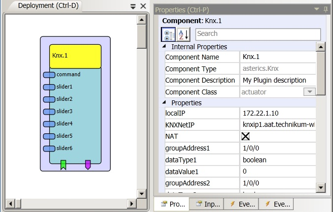

# KNX

### Component Type: actuator (Subcategory: Home Control)

The KNX plugin enables the ARE to interface a KNX installation. This plugin utilizes the calimero java library (http://calimero.sourceforge.net/) for the KNX implementation, it is (C)opyrighted 2006-2008 by W. Kastner and released under the GNU General Public License (FSF v2 or later). The KNX plugin provides an interface to the KNX home automation bus via a KNXnet/IP router. KNX actuators with specific group addresses can be switched on or off, or a specific value can be sent to the KNX actuators. This allows control of lightning, heat and ventilation, blend control or other utilization of other home automation facilities via the AsTeRICS platform.

  
KNX plugin

## Requirements

- A KNX infrastructure
- A little knowlege about KNX

## Functional Description

By starting the model, the KNX plugin establishes a connection to the KNX gateway specified by the plugin properties. The plugin has three different possibilities to interface KNX datapoints. The easiest way is to use the slider input ports, which are intended to be used to control dimming actuators. These ports always expect integer values (ports are of the type double but these are typecasted) and forward the value to a groupaddress specified by the plugin properties. The second way to send data to a KNX data point is by the 6 event listeners. Each of them can be configured individually by the plugin properties. The most universal way to send KNX commands is to use the command input of the KNX plugin. It expects a special formatted string and parses the dedicated keywords and format to a KNX command. The string can be assembled individually with other string formatting plugins. The KNX plugin has also some Event Trigger which can be assigned to various KNX Group Addresses within the properties. The KNX plugin listens to the bus and each time a massage with a specified Trigger Group Address is recognized an Event Trigger is issued. This kind of event handling requires dedicated KNX infrastructure setup.

## Input Port Description

- **command \[string\]:** This port receives string commands for the KNX component. The commands have to be in the format "@KNX: group_address,type,value". The delimiters ',', '#' and ' ' are allowed. An example for a valid command is"@KNX:1/1/1,boolean,true". As a valid command is received by the input port, the value is sent to the KNX group address. The group addresses comply to the setup of the KNX network which can be configured with the ETS4 software.
- **slider\[1-6\] \[double\]:** Input port for a double value which is converted to an integer and forwarded to a dedicated KNX datapoint

## Properties

- **localIP \[string\]:** The local IP address of the interface which can reach the KNXnetIP.
- **KNXNetIP \[string\]:** The destination IP address of the KNX gateway.
- **NAT \[boolean\]:** Enable NAT
- **groupAddress\[1-6\] \[string\]:** (Event Listener) Specifies KNX group addresses for the \[n\] Event Listener e.g. "1/1/1".
- **dataType\[1-6\] \[string\]:** (Event Listener) Specifies the data type of the dataValue\[1-6\] which is send to the KNX datapoint. The data type for values to be sent to the KNX group addresses. Following type are supported:

- _"boolean":_ e.g. used for switching light actuators on or off.
- _"int":_ used e.g. to control blend positions or light dimmer value.
- _"float":_ e.g. to control temperature of the building.
- _"string":_ e.g. so display text messages on a home automation console display.

- **dataValue\[1-6\] \[string\]:** (Event Listener) Specifies the data which will be converted to the coresponding data type.
- **groupAddressSlider\[1-6\] \[string\]:** Specifies KNX group addresses for the Slider\[n\] .
- **groupAddressTrigger\[1-6\] \[string\]:** Specifies KNX group addresses for the Event Trigger \[n\].

## Event Listener

- **send\[1-6\]:** Each time a event is triggered, the coresponding KNX command which is specified in the plugin properties, is issued.

## Event Trigger

- **event_out\_\[1-6\]:** Each time a event is triggered, the coresponding KNX command which is specified in the plugin properties, is issued.
