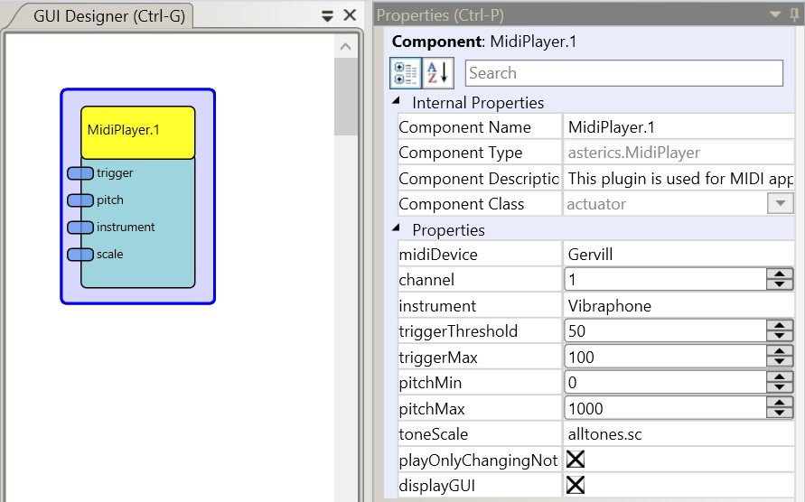

# Midi Player

Component Type: Actuator (Subcategory: Audio and Voice)

The MidiPlayer component can generate midi tone output on the default midi device of the system. This can be used for audio feedback (e.g. for a selection or click) or for creation of musical instruments. The MidiPlayer Plugin features an optional GUI where the currently played tone can be seen.

MidiPlayer GUI

  

MidiPlayer plugin

## Input Port Description

*   **trigger \[integer\]:** The input strength (tone trigger).
*   **pitch \[integer\]:** The tone height input.
*   **instrument \[string\]:** accepts a string which contains a valid instrument name to select this instrument
*   **scale \[string\]:** accepts a string which contains a tone scale name to select this tone scale

## Properties

*   **midiDevice \[combobox\]:** The Midi Output device. This combobox allows selection of an installed Midi device for tone output. **Supports value suggestions from ARE (dynamic property)**
*   **channel \[combobox\]:** The midi channel (1-16, 10 usually is the drum channel).
*   **instrument \[combobox\]:** The midi instrument or controller (the first 127 selections are instruments, then 127 controllers are available. if a controller is selected, the incoming pitch value is use as control change value). **Supports value suggestions from ARE (dynamic property)**
*   **triggerThreshold \[integer\]:** The value of the trigger input threshold. Tones will only be generated if the trigger input is bigger than this value. If the trigger inptu is not used, all tone heights received at the pitch input port are played with full volume.
*   **triggerMax \[integer\]:** The maximum value of the trigger input. This value influences the volume of the played tones: Tones will get louder as the trigger input value approaches the triggerMax value.
*   **pitchMin \[integer\]:** The minimum value for pitch input. Defines the pitch input value for the lowest tone output.
*   **pitchMax \[integer\]:** The maximum value for pitch input Defines the pitch input value for the highest tone output.
*   **toneScale \[integer\]:** One of several tone scales can be selected. The tonscales are stored in the plugin's subfolder in the ARE. **Supports value suggestions from ARE (dynamic property)**
*   **playOnlyChangingNotes \[boolean\]:** If selected, only different note values are triggered (else, same note values can be played multiple times)
*   **displayGUI \[boolean\]:** If this property value is set to true, the GUI window for the MidiPlugin will be displayed. The GUI window shows the current tone height and the available feedback tone scale.