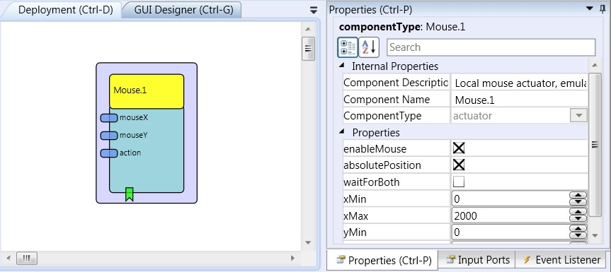

# Mouse

### Component Type: Actuator (Subcategory: Input Device Emulation)

The Mouse component allows mouse cursor positioning and clicking on the computer the ARE is running on (by software emulation). The mouse x-position, y-position, press/release actions of three mouse buttons and mouse-wheel movements can be controlled via desired input values and event triggers.

  
Mouse plugin

## Input Port Description

- **mouseX \[double\]:** The desired X-Position of the mouse. **This input port supports synchronization**
- **mouseY \[double\]:** The desired Y-Position of the mouse. **This input port supports synchronization**
- **action \[string\]:** Input port for a command string. This command string allows to modify the action of the next left mouse click - it can be set to trigger other types of mouse clicks. Following command strings are accepted:
  - _"@MOUSE: nextclick, right":_ next left click event will create a right mouse button click.
  - _"@MOUSE: nextclick, double":_ next left click event will create a double click.
  - _"@MOUSE: nextclick, middle":_ next left click event will create a middle button click
  - _"@MOUSE: nextclick, drag":_ next left click event will hold the left mouse button.
  - _"@MOUSE: nextclick, release":_ next left click event will release the left mouse button.
  - _"@MOUSE: action, enable":_ enables all mouse actions.
  - _"@MOUSE: action, disable":_ disables all mouse actions.
  - _"@MOUSE: action, toggle:_ enables / disables all mouse actions.

## Event Listener Description

- **leftClick:** An incoming event at this port creates a mouse button click. A left mouse button click will be generated, unless a valid "nextclick..." command has been received at the cmd input which changed the click type (see above).
- **middleClick:** A click with the middle mouse button is generated.
- **rightClick:** A click with the right mouse button is generated.
- **doubleClick:** A double click with the left mouse button is generated.
- **dragPress:** The left mouse button is pressed (but not released again).
- **dragRelease:** The left mouse button is released.
- **wheelUp:** The mouse wheel is turned one position from the user.
- **wheelDown:** The mouse wheel is turned one position to the user.
- **activate:** enables all mouse actions.
- **deactivate:** disables all mouse actions.
- **toggle:** enables / disables all mouse actions.

## Properties

- **enableMouse \[boolean\]:** The value of this property specifies if all mouse actions are bypassed (false) or enabled (true).
- **absolutePosition \[boolean\]:** If this property value is set to false, incoming values at the mouseX and mouseY input ports are interpreted as relative movement information. The values are summed up (integrated) to calculate the absolute position. If the property value is set to true, the values of the input ports are treated as absolute x/y positions.
- **xMin \[integer\]:** The minimum value for the X-coordinate (the mouse will not move farther to the left).
- **xMax \[integer\]:** The maximum value for the X-coordinate (the mouse will not move farther to the right). **If the xMax property is set to 0, the horizontal screen resoltion will be assumed as maximum x-position for the mouse cursor.**
- **yMin \[integer\]:** The minimum value for the Y-coordinate (the mouse will not move farther up).
- **yMax \[integer\]:** The maximum value for the Y-coordinate (the mouse will not move farther down) **If the yMax property is set to 0, the vertical screen resoltion will be assumed as maximum y-position for the mouse cursor.**.
