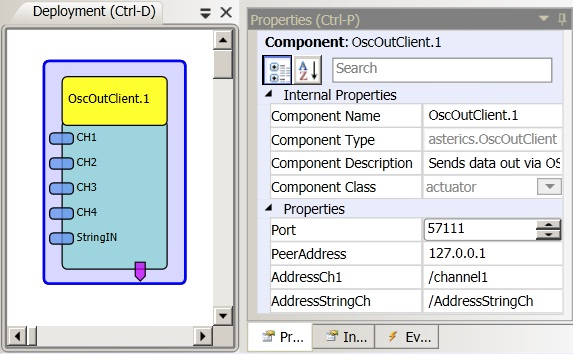

# OscOutClient

### Component Type: actuator (Subcategory: Communication)

The OscOutClient plugin enables the ARE to broadcast messages using the OpenSoundControl (OSC) protocol.
This plugin utilizes the NetUtil java library (http://www.sciss.de/netutil/) for the OSC implementation, it is (C)opyrighted 2004-2011 by Hanns Holger Rutz and released under the GNU Lesser General Public License.

  
OscOutClient plugin

## Requirements

- Nothing, works sand-alone within ARE
- Check your firewall configuration and network settings to ensure that OSC messages are not blocked.

## Functional Description

The OscOutClient collects data form the inputs CH1-4 and assamble it to one OSC message with 4 arguments.
The address for the OSC channel is set by the property AddressCh1.
Furthermore the plugin has a StringIN input port.
If the plugin receives a string it broadcast one OSC message with one string argument.
The address for the string OSC channel is set by the property AddressStringCh.

## Input Port Description

- **CH\[1-4\] \[double\]:** Input port for the data, eg. a oszilloscope or any other double value.

## Properties

- **Port \[integer\]:** This value specifies the OscOutClient port.
- **PeerAddress \[string\]:** Specifies the IP where the OSC server is listening.
- **AddressCH1 \[string\]:** This value specifies the OSC data output address e.g. "/path/to/receiver/accxyz".
- **AddressStringCh \[string\]:** This value specifies the OSC string output address.

## Referred Plugins

- OscServer
- OpenVibe
- OscGestureFollower
