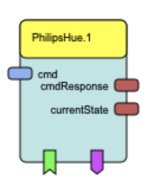
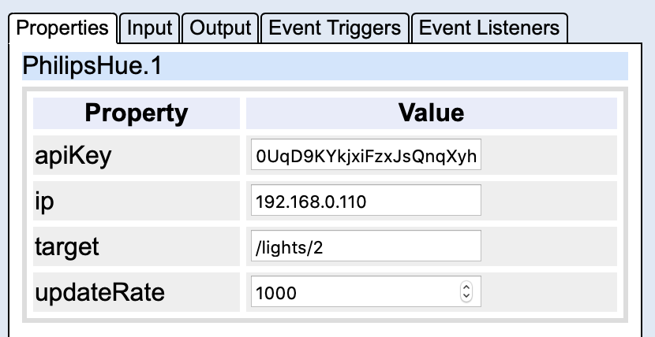

# PhilipsHue

Component Type: Actuator (Subcategory: Home Control)

The PhilipsHue component provides an interface to the
[Philips Hue smart lighting system](https://www2.meethue.com/en-us). 

One instance of this plugin can be used to control one specific Philips Hue light
or all lights connected to the Philips Hue bridge at the same time.

Philips Hue plugin

## Requirements

* A Philips Hue hardware Bridge
* A Philips Hue Light (such as a fixture, a light bulb or an LED stripe)

## Initial Setup

### Hardware

The bridge has to be connected to the ethernet port of the router. The light has to be paired with the bridge. 

Any device that ships with the bridge is already paired and ready to be used.

If they have been acquired separately you can pair them like so:
1. Connect the new light to an outlet or fixture close to the bridge
2. Open the Philips Hue app on your phone
3. Go to *Settings*, select *Light Setup* and press the *plus* icon
4. Tap on *search* to search for the new light

If the light is not found you can enter the serial number (printed on the light)
and tap search again.

###  Bridge IP address and API key

The plugin requires the an the IP address of the bridge and an API key.

First let's find out the IP address:

1. Open the Philips Hue app on your phone
2. Go to *Settings*, select *Hue Bridges* and press the *i* icon
3. Look for the line that says *IP address*

Now let's create a new API key using the CLIP API debugger.

1. Open `http://<bridge_ip>/debug/clip.html` in your browser
2. Enter `/api` in the *URL* text field
3. Enter `{"devicetype": "<new_username>"}` in the *Message Body* text field
4. Press the round link button on the Hue bridge
5. Click on the *POST* button
6. The string in the double quotes to the right of `username` is your API key

After adding the PhilipsHue plugin in the Model Designer you can fill out those properties.

Philips Hue properties

The target light ids are assigned from the bridge to the lights in order, starting with 1. 

You can also send a *GET* request to the URL `http://<bridge_ip>/api/<API_key>/lights`
with the CLIP API debugger.
This return a JSON dictionary. The keys of that dictionaries are the light ids, 
and the values can be used to identify the lights (by name, model or serial number).

## Input Port Description

*   **cmd \[string\]:** This port expects JSON (see [Hue Lights API](https://developers.meethue.com/develop/hue-api/lights-api/)) and sends the command to the specified light.
    * Example 1: turn light off: `{"on": false}`
    * Example 2: set light to red with full saturation: `{"hue": 0, "sat": 254}`
    * Example 3: turn light on and enable color loop effect: `{"on": true, "effect": "colorloop"}`

## Output Port Description

*   **cmdResponse \[string\]:** This port returns the reply from the bridge (in JSON).
*   **currentState \[string\]:** This port periodically returns the state the target light. The polling rate can be set via the updateRate property (in milliseconds).

## Event Listener Description

* **lightOn:** turn target light on
* **lightOff:** turn target light off
* **lightWhite:** turn target light white (neutral color, 100% brightness)
* **lightRed:** turn target light red
* **lightGreen:** turn target light green
* **lightBlue:** turn target light blue
* **lightBriLow:** set brightness of target light to 10%
* **lightBriHalf:** set brightness of target light to 50%
* **lightBriFull:** set brightness of target light to 100%
* **lightSaturate:** set saturation of target light to 100%
* **lightDesaturate:** set saturation of target light to 0%
* **allLightsOn:** turn all lights on
* **allLightsOff:** turn all lights off
* **allLightsWhite:** reset all lights (neutral color, 100% brightness)
* **allLightsRed:** turn all lights red
* **allLightsGreen:** turn all lights green
* **allLightsBlue:** turn all lights blue
* **allLightsColorloop:** activate the colorloop effect for all lights
* **allLightsBriLow:** set brightness for all lights to 10%
* **allLightsBriHalf:** set brightness for all lights to 50%
* **allLightsBriFull:** set brightness for all lights to 100%
* **allLightsSaturate:** set saturation for all lights to 100%
* **allLightsDesaturate:** set saturation for all lights to 0%

## Event Trigger Description

* **statusChanged:** fires when any light changes its status
* **tick:** fires for each tick (depends on updateRate property)
* **turnedOn:** fires if the light is turned on
* **turnedOff:** fires if the light is turned off

## Properties

* **apiKey \[string\]:** API key for the REST API of the bridge
* **ip \[string\]:** IP address of the bridge
* **target \[string\]:** light to be controlled in the form `/light/<id>`
* **updateRate \[integer\]:** polling rate for **currentState** and the event triggers
    * value in milliseconds
    * the lower this value is, the faster you will be notified of changes
    * don't set this too low or the bridge might slow down (500 milliseconds is a good compromise)

## Notes

* There is an example file (`philipshue.acs`) that demonstrates the full capabilities of the plugin.
it can be found in the folder: `bin/ARE/models/useCaseDemos/environmentControl/`.
* The CLIP API debugger will not work if your browser has strict XSS (cross-site scripting) protection enabled.
In that case you can use another REST API debugger (like [Postman](https://www.getpostman.com/)).
* If you have any other issue or need help you can drop the author a line: bmedicke@gmail.com