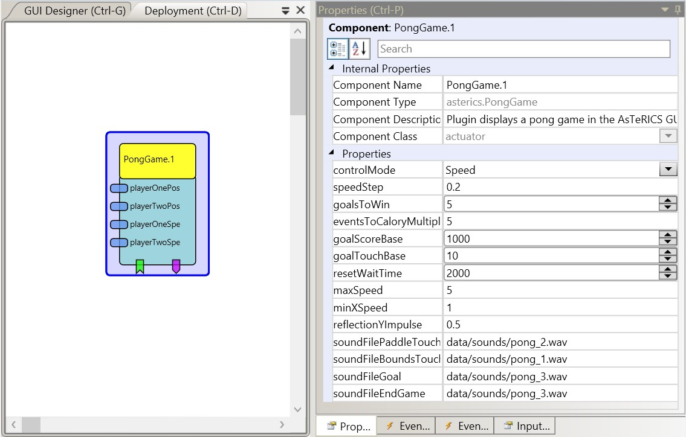
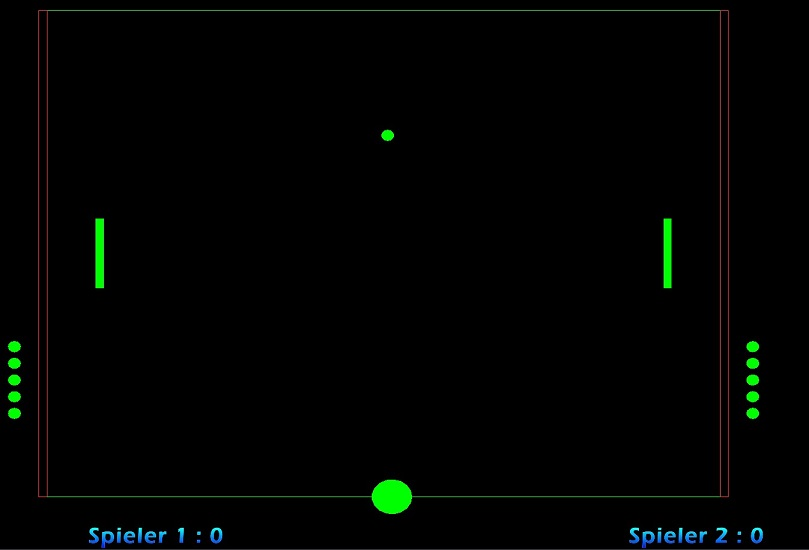
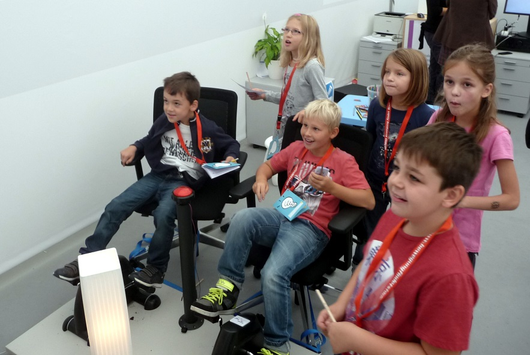

# Pong

### Component Type: Actuator (Subcategory: Others)

The Pong component is an implementation of the classic "pong"-game, where two players control their paddles and try to hit a moving ball. The Pong component offers different input modalities (speed or event-based) so that the game can be played via a wide range (and combination of) sensors. Two users can play the game using different sensors. Several game options can be controlled by the plugin properties.

  
Pong plugin

  
Pong game screen

## Application

A special "bike-Pong" interface has been developed at UAS Technikum Wien, which allows playing the game via bicycle ergometers. For this purpose, the Arduino microcontroller (and corresponding plugin) are utilized to measure the user interactions and deliver the data to the Pong plugin. The energy created by the pong-players can be calculated in calories (this mode makes only sense when the bike-ergonometers are connected, see properties) Please note that the bike mode only works well with a screen resolution of 1920x1090 because of the utilized background graphics.

  
bike-ergomenter controlled pong game

## Input Port Description

- **playerOnePos \[integer\]:** This input port defines the position of player one's paddle (0 to 300)
- **playerTwoPos \[integer\]:** This input port defines the position of player two's paddle (0 to 300)
- **playerOneSpeed \[integer\]:** This input port defines the speed of player one's paddle (-10 to 10)
- **playerTwoSpeed \[integer\]:** This input port defines the speed of player two's paddle (-10 to 10)

## Event Listener Description

- **startGame:** An incoming event starts/restarts the game
- **playerOneToggleDirection:** An incoming event changes the direction of player one's paddle (only relevant for event-based paddle control mode).
- **playerTwoToggleDirection:** An incoming event changes the direction of player two's paddle (only relevant for event-based paddle control mode).
- **playerOneMovement:** An incoming event moves player one's paddle one step (only relevant for event-based paddle control mode). This input is also used for the calculation of the total amount of engery.
- **playerTwoMovement:** An incoming event moves player two's paddle one step (only relevant for event-based paddle control mode). This input is also used for the calculation of the total amount of engery.

## Properties

- **controlMode \[combobox selection\]:** selects the mode for controlling the paddle positions. possible selections are: absolute position (via input port), speed (via input port) or single events.
- **speedStep \[double\]:** defines the amount of movement caused by one event.
- **goalsToWin \[double\]:** number of goals to win a game (player lives).
- **eventsToCaloryMultiplier \[double\]:** factor to calculate energy (in calories) from incoming events (especially for the bike ergometer application) Setting this property value to 0 deactivates the energy calculation and the respective game report screens (default).
- **goalScoreBase \[integer\]:** game points for one goal.
- **touchScoreBase \[integer\]:** game points for one ball hit.
- **resetWaitTime \[integer\]:** time to wait before resetting game screen.
- **maxSpeed \[double\]:** the maximum speed of the ball.
- **minXSpeed \[double\]:** the minimum X speed of the ball (to avoid deadlocks of the gameplay).
- **reflectionYImpulse \[double\]:** speed impluse gained from a vertical reflection of the ball.
- **soundFilePaddleTouch \[string\]:** a wav file which is played when the ball touches a paddle.
- **soundFileBoundsTouch \[string\]:** a wav file which is played when the ball touches the vertical bounds.
- **soundFileGoal \[string\]:** a wav file which is played when a player missed a ball.
- **soundFileEndGame \[string\]:** a wav file which is played when the game is over.
