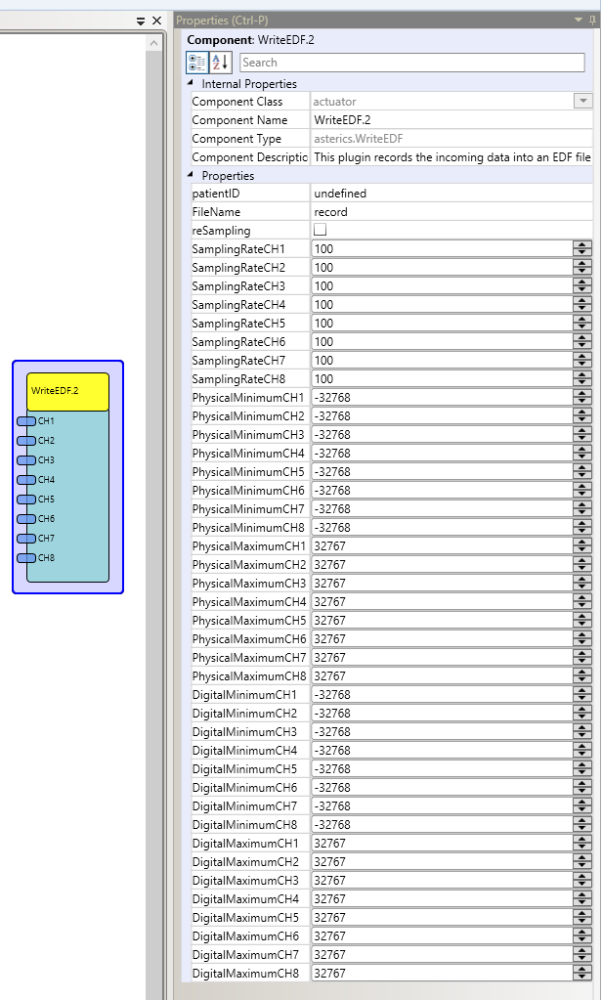

# EDF Writer

### Component Type: Actuator (Subcategory: File System)

This plugin writes the incoming data into an .edf file (http://www.edfplus.info/specs/edf.html)

The data gets live recorded, so it can be viewed simulaneously in the EDF-Browser ( http://www.teuniz.net/edfbrowser/ )

  
WriteEDF

## Input port Description

- **CH1 - CH8\[double\]:** these ports get the data, which will be recorded.

## Properties

- **PatientID\[string\]:** specifies the name of the subject. Maximum number of characters: 80
- **FileName\[string\]:** specifies the name of the file (without extension ), in which the data will be recorded
- **reSampling\[boolean\]:** If this box is checked, the incoming data will be resampled with the chosen frequency of the properties samplingRateCH1 - CH8. This could be neccessary, if the incoming data frequency is not known
- **SamplingRateCH1 - CH8\[integer\]:** specifies the frequency of the incoming data. Values smaller than 1 will deactivate the corresponding channel
- **PhysicalMinimum CH1 - CH8 \[integer\]:** specifies the minimum values of the incoming data
- **PhysicalMaximum CH1 - CH8 \[integer\]:** specifies the maximum values of the incoming data
- **DigitalMinimum CH1 - CH8 \[integer\]:** specifies the minimum values of the stored data
- **DigitalMaximum CH1 - CH8 \[integer\]:** specifies the maximum values of the stored data
