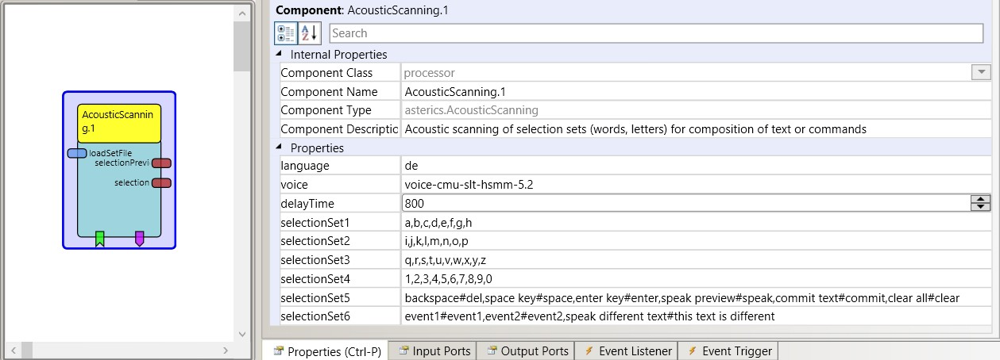

# AcousticScannning

Component Type: Processor (Subcategory: Audio and Voice)

The purpose of this component is to provide a stepwise, voice assisted selection of a large number of options. Examples for use cases are the selection of individual letters for text composition or selection of spoken phrases (eg. for environmental control via the amazon echo device). The component uses the MaryTTS text-to-speech library which supports multiple languages and voices. Currently, the component is in beta stage and only one english female voice and one german male voice are included.

The component provides up to 6 selectionSets. A selectionSet contains a number of individal items, seperated by commas (e.g. a number of letters for spelling words). When a selectionSet is started (by an incoming event), every selection item is spoken with an adjustable pause between the items. If an event is received at the "selection" event listener port during the presentation or pause time of a particular item, this item is added to the "preview string" output port. When the preview string contains the finalized word/phrase/sentence, it can be sent to the "selection" output port.

Additional functionalities can be given to the selection items via commands strings which are added to a selection item (seperated by the #-character). Supported command strings allow the deletion of the last character, the speaking of the currently composed text and other functions which are described below, thereby increasing the flexibility of the plugin. For more information see the demo model (ACS/models/componentTests/processors/AcousticScanning\_test.acs)

AcousticScanning plugin

## Input Port Description

*   **loadSetFile \[string\]:** Path/name of a file which contains alternative selectionSets (which override the default selectionSets defined in the properties "selectionSet1"-"selectionSet6". The selectionSets are provided as individual lines, terminated with a newline character. (This functionality is currently not supported.)

## Output Port Description

*   **selectionPreview \[string\]:** Output of preview string. This output port shows the current word/phrase/sentence which is composed or spelled using the stepwise scanning process.
*   **selection \[string\]:** The finalized word/phrase/sentence is sent to this output port when an item containing the #commit command string has been selected.

## Event Listener Description

*   **selectionSet1-selectionSet6:** an incoming event starts the acoustic scanning process of the given selection set.
*   **select:** selects the currently spoken item and adds the item text to the preview string (or executes the command associated with the selected item)

## Event Trigger Description

*   **event1-event10:** These events are triggerd if the currently selected item contains the command string "event1", "event2", etc.

## Properties

*   **language \[string\]:** The languge of the text-to-speech engine (currently only "en" and "de" are supported).
*   **voice \[string\]:** The voice for the given language (currently this property is ignored, there is only one german and one english voice which are selected automatically due to the value of the language property).
*   **selectionSet1 \[string\]:** The items of selectionSet1, separated by commas.
*   **selectionSet2-selectionSet6 \[string\]:** The items of selection sets 2-6. In the following a list of all currently supported command strings is given:
    *   _#del:_ deletes one charater from the preview string.
    *   _#clear:_ clear the preview string.
    *   _#space:_ adds a space key to the preview string.
    *   _#enter:_ adds the text {ENTER} to the preview string (this generates an enter key when sent to the keyboard actuator plugin).
    *   _#speak:_ speaks the preview string.
    *   _#commit:_ sends the preview string to the output port "selection" and clears the preview string. This can be used to write the composed word/phrase to a keybaord actuator etc.
    *   _#event1:_ sends an event via event trigger port "event1".
    *   _#event2:_ sends an event via event trigger port "event2".
    *   _#event3 - #event10:_ sends an events via event trigger ports event2 - 10.
    *   _other text which follows a hash character will be spoken when the item is selected_
*   _An example of a valid selection set:_ "a,b,c,d,e,f,g" for the first 7 letters of the alphabet.
*   _Another example including command strings:_ "backspace#del,start music#event1".
*   _Note_ that the selectionSet is specified without the double quotation marks and without spaces after the commas.