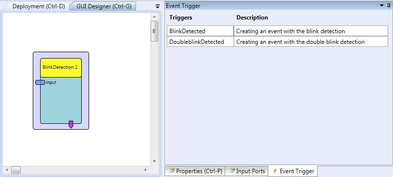

# Blink Detection

### Component Type: Processor (Subcategory: DSP and Feature Detection)

This component detects the shape that a blink produces in an electro-oculogram signal. The plugin analyses the input samples and recognises both a single blink and a double blink. Here a single blink is defined by an action whereby both eyes are simultaneously and voluntary closed and open. A double blink refers to the repletion of this action twice in an consecutive way. When one of these conditions is found the corresponding event is fired. In addition, a true Boolean will be output to the corresponding output port.

  
Blink Detection plugin

## Requirements

The input signal shall correspond to a 250-Hz sampled electro-oculogram signal, i.e., an output port of the [Enobio](../sensors/Enobio.htm) component when the corresponding electrode is placed on the user's forehead.

## Input Port Description

- **input \[integer\]:** Input values that correspond to a 250-Hz sampled electro-oculogram signal.

## Event Trigger Description

- **BlinkDetected:** This event port fires an event if a blink is detected in the input sequence of integers.
- **DoubleblinkDetected:** This event port fires an event if a double blink is detected in the input sequence of integers.
