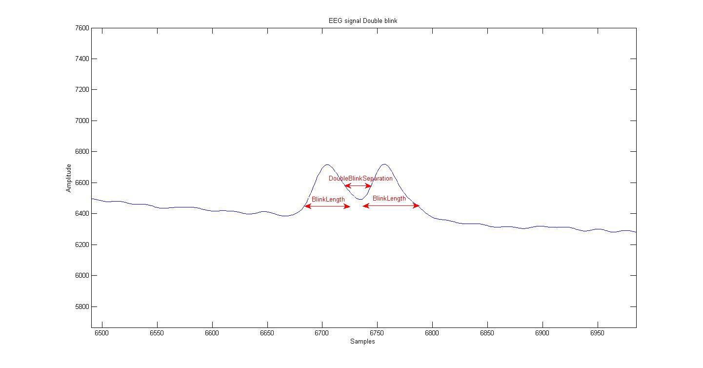
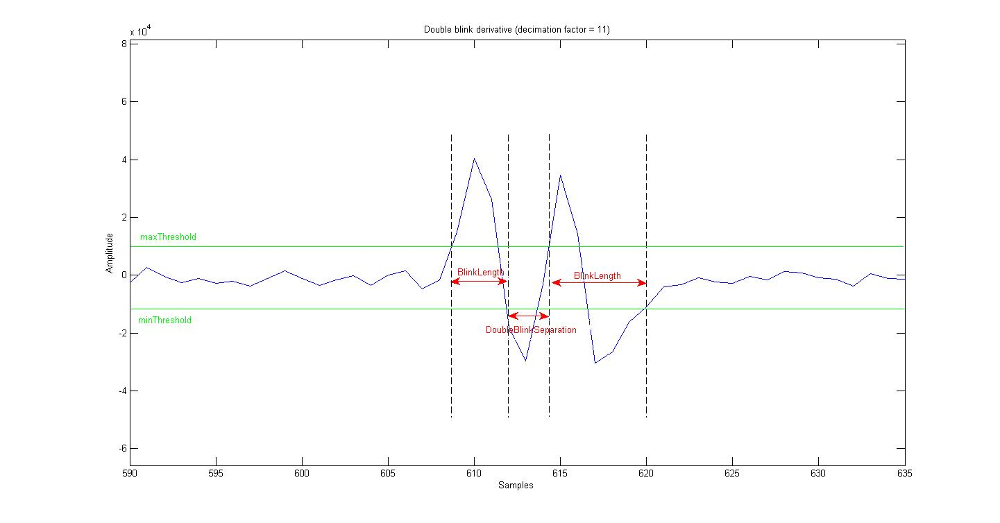
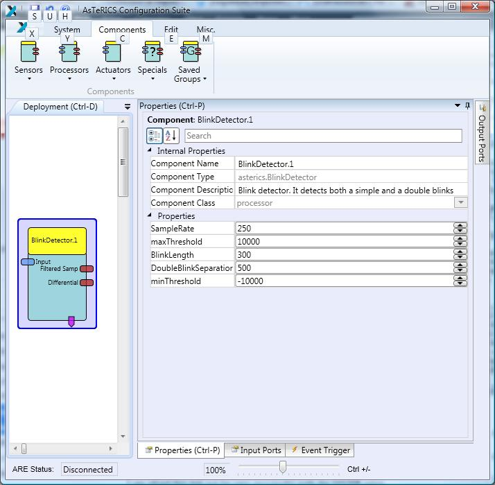

# Blink Detector

Component Type: Processor (Subcategory: DSP and Feature Detection)

This component detects the shape that a blink produces in an electro-oculogram signal. The plugin analyses the input samples and recognises both a single blink and a double blink. Here a single blink is defined by an action whereby both eyes are simultaneously and voluntary closed and open. A double blink refers to the repletion of this action twice in an consecutive way. When one of these conditions is found the corresponding event is fired.  
Note that the plugin will only detect simple or double blinks with a duration smaller than BlinkLength miliseconds. Similarly, it will only detect double blinks that are separated by less than DoubleBlinkSeparation miliseconds. In addition, the "strength" of the blinks is defined by the maxThreshold and minThreshodld properties:

EEG signal double blink

Double blink derivative

In order to propperly configure these 4 properties, they should be previously obtained by running the [BlinkDetectorTrainer][1] plugin for each different subject.  
In order to correctly detect simple and double blinks, the input signal is internally decimated by a factor of 11 and derivated. For debugging purposes, the decimated samples and the derivated samples are output to the corresponding output ports.

Blink Detector plugin

## Requirements

The input signal shall correspond to a 250-Hz sampled electro-oculogram signal, i.e., an output port of the [Enobio][2] component when the corresponding electrode is placed on the user's forehead.

## Input Port Description

- **input \[integer\]:** Input values that correspond to a 250-Hz sampled electro-oculogram signal.

## Output Port Description

- **Filtered Sample \[integer\]:** For each input sample, this output port delivers the decimated sample with a decimation factor of 11.
- **Differential \[integer\]:** For each input sample, this output port delivers the derivated sample (after the decimation).

## Event Trigger Description

- **BlinkDetected:** This event port fires an event if a blink is detected in the input sequence of integers.
- **DoubleblinkDetected:** This event port fires an event if a double blink is detected in the input sequence of integers.

## Properties

- **sampleRate \[integer\]:** Sample rate of the input signal in Hertz.
- **maxThreshold \[integer\]:** Positive threshold for a peak in the derivated signal to be considered as a potential blink (see "Double blink derivative" figure).
- **minThreshold \[integer\]:** Negative threshold for a peak in the derivated signal to be considered as a potential blink (see "Double blink derivative" figure).
- **BlinkLength \[integer\]:** Duration of one blink in miliseconds (see "Double blink derivative" figure).
- **DoubleBlinkSeparation \[integer\]:** Separation (in miliseconds) between two blinks that correspond to a double blink (see "Double blink derivative" figure).

[1]: ../processors/BlinkDetectorTrainer.htm
[2]: ../sensors/Enobio.htm
