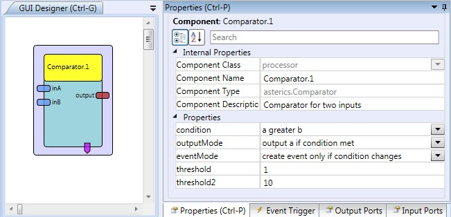

  
---
Comparator
---

# Comparator

### Component Type: Processor (Subcategory: Basic Math)

This component compares the numerical values of two input ports and provides output depending on the result of the comparison.

  
Comparator plugin

## Input Port Description

*   **inA \[double\]:** Input port for signal a. **This input port supports synchronization**
*   **inB \[double\]:** Input port for signal b. **This input port supports synchronization**

## Output Port description

*   **out \[double\]:** Output port of the comparator (value according to condition and operational mode).

## Event Trigger Description

*   **conditionTrue:** This event is triggered when the comparator condition switches from false to true.
*   **comparatorFalse:** This event is triggered when the comparator condition switches from true to false.

## Properties

*   **condition \[integer\]:** Defines the condition to be met. Available conditions are "a greater b", "a equals b", "a lower b", "a greater threshold", "a equals threshold", "a lower threshold" and "a between threshold and threshold2".
*   **outputMode \[integer\]:** Defines the mode of operation, respectively which values are put to the output port of the plugin. Following modes are available: "output min", "output max" and "output a if condition met".
*   **eventMode \[integer\]:** Defines the mode of event generation (if events are created on every comparison of input values or only if the output condition changes).
*   **threshold \[double\]:** Defines the threshold value for the condition modes "a greater than threshold", "a equals threshold" and "a lower than threshold".
*   **threshold2 \[double\]:** Defines the threshold2 value for the condition mode "a between threshold and threshold2".