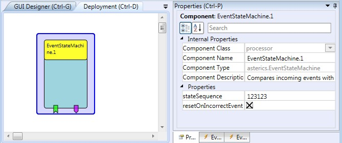

# EventStateMachine

Component Type: Processor (Subcategory: Event and Signal Processing)

This component allows definition of a sequence of events (up to 9 different incoming events are supported). If the sequence appears at the event listener ports in the given order, an event is fired by the EventStateMachine plugin. Optionally, a timing can be specified for a valid event sequence.

Event State Machine plugin

## EventStateMachine Description

- **in1-in9:** Incoming events
- **reset:** Resets the current state detection to the first element of the sequence

## Event Trigger Description

- **finalStateReached:** fired if the last element of the sequence is reached.
- **stateError:** fired if an incoming event does not fit the sequence.
- **stateChanged:** fired if a new state of the sequence is reached.

## Properties

- **stateSequence \[string\]:** A sequence of digits separated by commas, representing the order of incoming events, for example: "1,5,2,3,1".
- **stateTiming \[string\]:** An (optional) sequence of timings for the above events, specified in min/max milliseconds for a state transition. One timing information consists of a numeric value for the maximum time or two numeric values separated by a forward slash (/) for minimum and maximum time. For example the timing "1000/2000,500/1000,x,3000" defines that the transition from first to second state my take a minimum of 1000 milliseconds and a maximum of 3000 milliseconds; The transition to the next state may trake 500-1000 milliseconds, the next transition has no timing contraints, the next transition may take up to 3000 milliseconds. If this property is left empty, no timing constraints are active for the event state transitions.
- **resetOnIncorrectEvent \[boolean\]:** if checked, an incoming event which does not fit the current element of the sequence will reset the state detection to the first element of the sequence.
