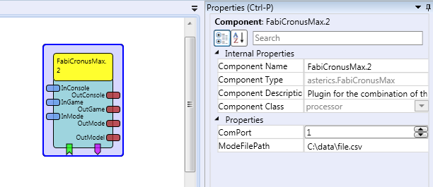
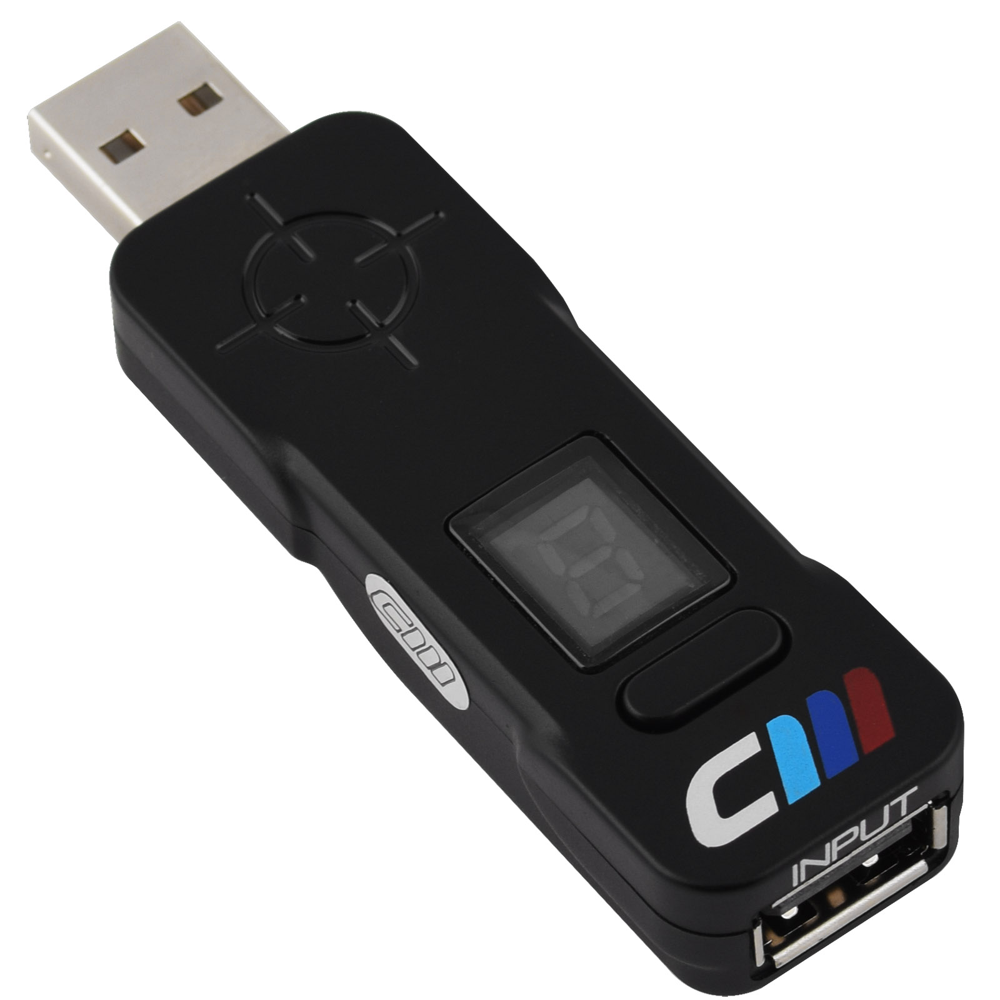

  
---
FabiCronusMax
---

# FabiCronusMax

### Component Type: Processor (Subcategory: Microcontroller Interface)

This component provides an interface for the FABI controller and the CronsuMax USB stick. It enables the programming process of the FABI as well as the configuration for all supported gaming consoles. It is possible to configure the buttons which are connected to the FABI controller and store the set to the built-in EEPROM. Via the plugin the CronusMax stick controls the selected gaming device through the external buttons connected to the FABI. The set of buttons can be defined in a configuration file and modified for each game and console.

  
FabiCronusMax plugin

  
CronusMax USB Stick

## Requirements

The Plugin requires a FABI2.0 compatible Version as well as the right COM Port. The Baudrate for the FABI controller is predefined at 9600 Baud. Additionally a CronusMax device is necessary as well as the software GTuner ([GTuner download](http://controllermax.com/downloads/))

## Input Port Description

*   **InConsole \[string\]:** Input of the selected Console (e.g. PS3)
*   **InGame \[string\]:** Input of the selected Game (e.g. Need For Speed)
*   **InMode \[Integer\]:** Input of the selected Mode (e.g. 1)

## Output Port Description

*   **OutConsole \[string\]:** Output of the selected Console (e.g. PS3)
*   **OutGame \[string\]:** Output of the selected Game (e.g. Need For Speed)
*   **OutMode \[Integer\]:** Output of the selected Mode (e.g. 1)
*   **OutModel \[string\]:** Output for the next model to be started
*   **OutButtons \[string\]:** Output for the buttons in current mode, separated through a comma ','

## Event Listener Description

*   **ModeSwitcher:** Switch between the modes.
*   **GameSwitcher:** Switch between the Games.
*   **ConsoleSwitcher:** Switch between the consoles.

## Event Trigger Description

*   **Busy:** Triggered if Fabi is busy.
*   **Ready:** Triggered if Fabi is ready.
*   **loadModel:** Triggered to load new model.

## Properties

*   **ComPort \[integer\]:** COM Port of FABI.
*   **ModeFilePath \[string\]:** Path to the file with the configuration.

## Configuration file

The configuration file has to be a \*.CSV file and the data has to be separated with ','. The following two lines show the structure of a configuration file:  
  
XBOXONE, BattleField, Mode, KEY\_A, KEY\_B, Mode, KEY\_1, KEY\_2  
XBOX360, Formel1, Mode, KEY\_A, KEY\_B, KEY\_C, KEY\_D, KEY\_E  
  
The first field defines the console and the second one defines the game. "Mode" signals that the following fields are the keycodes which are connected to the buttons in the right order. There can be up to 10 modes per game and up to 6 buttons per mode.