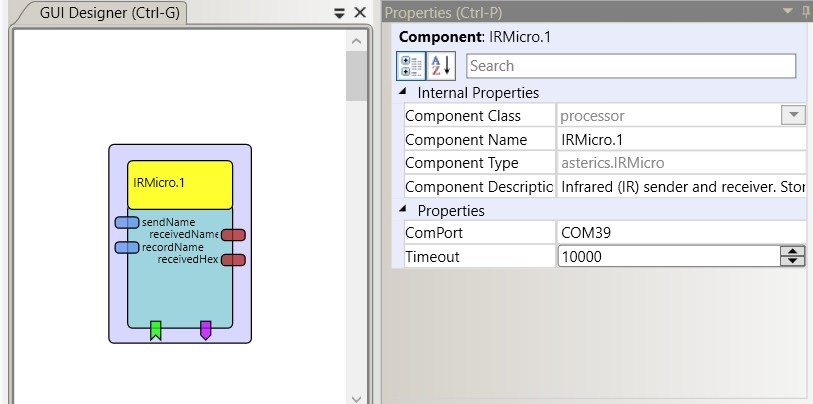

# IrMicro

## Component Type: Processor (Subcategory: Home Control)

The IRMicro plugin connects to a Microcontroller via a COM port in order to receive and sent infrared (IR-) remote control commands (raw timing values). The values are stored in (or loded from) .csv file (one file per command, given the command's name as filename.csv) in the ARE subfolder ./data/processor.IRMicro

IrMicro plugin

## Requirements

A connection to a microcontroller running the IrMicro firmware is required. The IrMicro firmware is provided in folder /CIMS/IrMicro. This firmware is an Arduino Sketch for record/replay of infrared commands. Connect a TSOP module (e.g. TSOP4838) to pin 11 and an IR led with current-limiting resistor to send pin of a compatible microcontroller (for examle pin 3 for the Arduino Uno). For a list of compatible controllers and default send pins see: [IR-Remote Github repository][1]

## Input Port Description

*   **sendName\[string\]:** A string which contains a known command name. The existing (recorded) commands are stored in .csv files in the folder ARE/data/processor.IRMicro. If the command file is found, the stored timing codes are replayed by the connected microcontroller  
    
*   **recordName\[string\]:** A string which contains the name of a command which shall be recorded. The microcontroller is put into recording mode and waits (until a given timeout) for an IR code to be received via the TSOP module. After a command has been recorded, the codes are stored in a .csv file (filename is the command name) in the folder ARE/data/processor.IRMicro.  
    

## Output Port Description

*   **receivedName\[string\]:** If a known IR command has been received via the microcontroller's TSOP module, the command name is put out on this port as a string
*   **receivedHex\[string\]:** The timing values of a known or unknown command are sent to this output port as a string

## Event Listener Description

*   **clearAll:** all stored IR-commands are cleared.
*   **clearLast:** the last recorded IR-command is cleared.

## Event Trigger Description

*   **recordFinished:** a new command was recorded successfully.
*   **recordTimeout:** the timeout value was reched when trying to record a new command.

## Properties

*   **ComPort\[string\]:** The name of the Comunication port which shall be opened in order to communicte with the microcontroller.
*   **Timeout\[integer\]:** The timeout for recording a new IR-command (in milliseconds).

[1]: https://github.com/z3t0/Arduino-IRremote