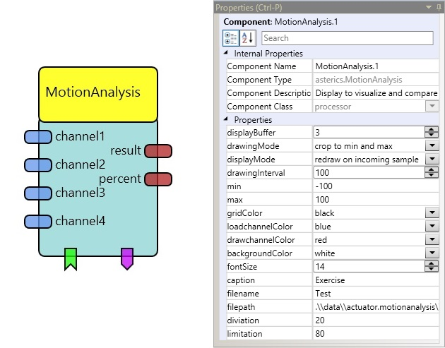
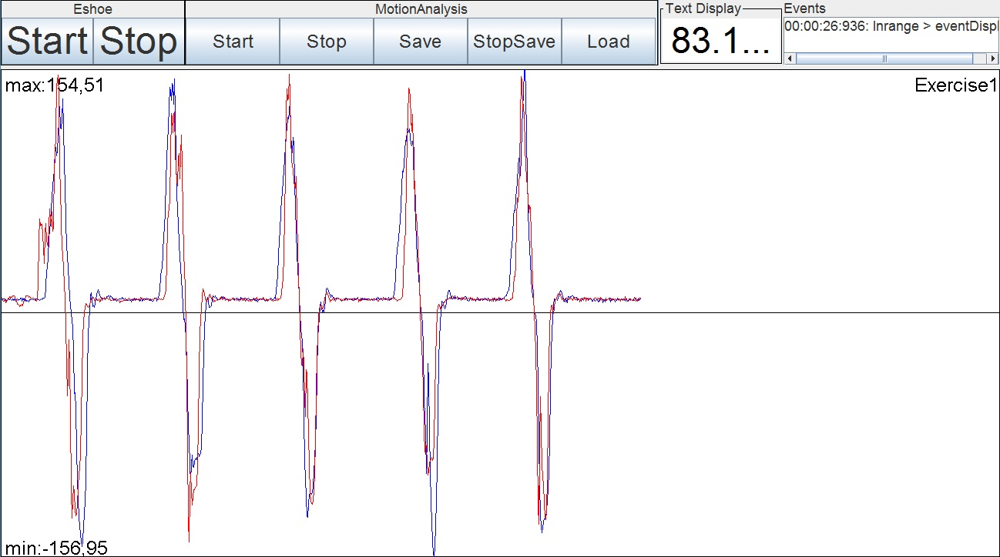

# MotionAnalysis

Component Type: Processor (Subcategory: DSP and Feature Detection)

The MotionAnalysis Plugin procides a visual feedback for one or more channels. With this Plugin it is able to save a movement and compare it to later movements. To test this plugin MotionAnalysis_Example.acs can be used.

### Save

To save an exercise the save button has to be pressed. A new file with the name of the filename properity is created. To start the start button has to be pressed. The save funktion can be paused when the stop button is pressed. To restart the start button has to be pressed. To stop the save funktion the stopsave button has to be pressed.

### Load

To load a file the load button has to be pressed. Then the explorer is opened an a file can be choosen. If a file is selected it is atomatically loaded in the graph. To start an exercise the start button has to be pressed. The exercies stops automatically when it is finished and a result is sent to the result output port.

MotionAnalysis plugin

Screenshot: MotionAnalysis plugin

## Input Port Description

- **channel1 \[double\]:** The input signal for channel one.
- **channel2 \[double\]:** The input signal for channel two.
- **channel2 \[double\]:** The input signal for channel three.
- **channel2 \[double\]:** The input signal for channel four.

## Output Port Description

- **result \[string\]:** Sends the match between the loaded movement and the aktual movement.
- **percent \[double\]:** Sends the actual position in percent of time.

## Properties

- **displayBuffer \[integer\]:** This property value specifies how often the oscilloscope window is drawn. For example if the display buffer size is 0, the oscilloscope traces are redrawn at every incoming value. If the display buffer size is set to 10, 10 values are stored in a buffer and drawn at once as the tenth value is received. This significantly reduces the computational resources spent for drawing the oscilloscope, which is useful especially at high update rates.
- **drawingMode \[integer\]:** Declares whether the y axis is adapting to mininum and maximum values automatically or to stay in preset bounds. This only affects the drawchannel not the loadchannel or the save option.
- **displayMode \[integer\]:** Affects the time when oscilloscope is redrawn. Can be set to the values "redraw on incoming samples" or "redraw periodically".
- **drawInterval \[integer\]:** Redraw interval in milliseconds (if periodic drawing is used).
- **min \[integer\]:** Preset minimum value for y axis of oscilloscope.
- **max \[integer\]:** Preset maximum value for y axis of oscilloscope.
- **gridColor \[integer\]:** The colour of the value-grid.
- **loadchannelColor \[integer\]:** The colour of the signal trace for the loaded value.
- **drawchannelColor \[integer\]:** The colour of the signal trace for the actual value.
- **backgroundColor \[integer\]:** The colour of the background of the oscilloscope window.
- **fontSize \[integer\]:** The size of the oscilloscope's caption.
- **caption \[string\]:** The caption to be displayed on the oscilloscope.
- **filename \[string\]:** The name of the saved file. There is added a time and date to not overwrite a file.
- **filepath \[string\]:** The path in wich the files are saved.
- **diviation \[integer\]:** The allowed diviation of the loaded value and the actual value in one point of time.
- **limitation \[integer\]:** The limitation of how much percent of match must be reached to raise an event.

## EventListener

- **Start:** Starts a movement.
- **Stop:** Stops a movement.
- **Save:** Starts to save a movement.
- **Stopsave:** Stops to save a movement.
- **Load:** Loads a movement.

## EventTrigger

- **Inrange:** Raises a event when the result is higher than the limitation.
