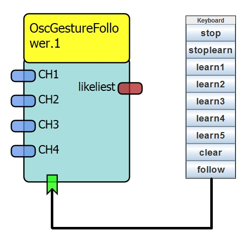

# Osc Gesture Follower

### Component Type: Processor (Subcategory: DSP and Feature Detection)

The OscGestureFollower component copule the ARE with a external gesture recognizer software. The program is copyrighted by IRCAM. The communication is based on the OpenSoundControl (OSC) protocol. This plugin utilizes the NetUtil java library (http://www.sciss.de/netutil/) for the OSC implementation, it is (C)opyrighted 2004-2011 by Hanns Holger Rutz and released under the GNU Lesser General Public License.

  
OscGestureFollower howto

## Requirements

- The plugin requires the gfOSC_v1.exe which contains the actual gesture follower algorithms.
- Check your firewall configuration and network settings to ensure that OSC messages are not blocked.

## Functional Principle

Input data is received through CH1 to CH4 e.g. acceleration measurement unit. Not all inputs must be connected, but the synchronized checkboxes have to be checked correct. The events must be connected like illustrated in the picture. First the gestures must be teached in. To teach in the first gesture, press the 'learn1' button. After finishing the first gesture, press 'learn2' to teach in the second gesture, and so on. After all gestures are teached in press 'stoplearn'. To clear all gestures press 'clear'. To start the gesture recognition process press 'follow'. To stop the gesture following process press 'stop'.

## Input Port Description

- **CH1 - CH4 \[double\]:** The input port which receive data values. **These 4 input ports support synchronization**

## Output Port Description

- **likeliest \[double\]:** While the gesturefollower is in 'follwing mode' the most likeliest gesture is indicated on the likeliest output port. Before it can sample the input data and recognize a gesture, some data must be teached in.

## Properties

- **InPort \[integer\]:** This value specifies the Port where OscMessages form the gesture follower are received.
- **OutPort \[integer\]:** This value specifies the Port where OscMessages are send to.

## Referred Plugins

- OscOutClient
- OpenVibe
- OscServer
