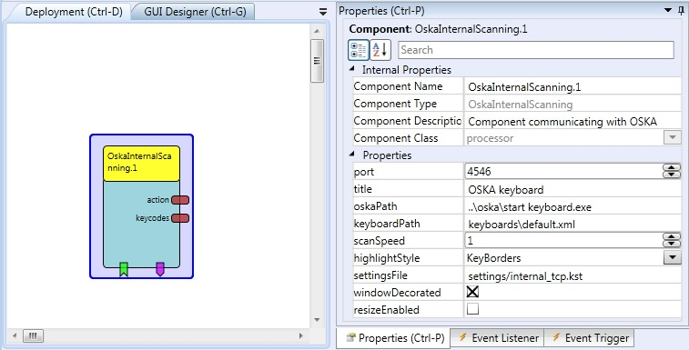

# OskaInternalScanning

Component Type: Processor (Subcategory: OSKA)

This component interacts with the On Screen Keyboard Application (OSKA) and forwards key selections and command (action-) strings to other ARE plugins. OSKA is set to use its internal scanning methods and the component exposes the two button input events that Oska can work with.

  
OskaInternalScanning plugin

## Requirements

This component requires Sensory Software's OSKA keyboard. OSKA is automatically started by the plugin if it is located in the expected path ("../OSKA/Start Keyboard.exe").

## Output Port Description

- **action \[string\]:** This output sends the action string which is attached to a specific key on the keyboard to connected components.
- **keycodes \[string\]:** This output sends the key codes which are attached to a key via the @KDB command.

## Event Listener Description

- **increaseScanspeed:** Incoming events will increase the internal scanning speed of OSKA.
- **decreaseScanspeed:** Incoming events will decrease the internal scanning speed of OSKA.
- **pressSwitch1:** Incoming events start the automatic scanning or switch to the next selection (to speed up the scanning).
- **pressSwitch2:** Incoming events switch from column- to row scanning (or in the next step select the cell). If the scanning is stopped, it will be started.

## Event Trigger Description

- **eventOut1-eventOut10:** These events can be triggered by selecting a cell which contains an @OSKA,event .. action string, (for example @OSKA,event 3).

## Properties

- **port \[integer\]:** This property defines the TCP port that the component listens on for connections of the OSKA.
- **title \[string\]:** This property defines the caption to be displayed in OSKA?s title bar.
- **oskaPath \[string\]:** The absolute path to the OSKA player as well as the program name is needed in order for the component to start OSKA by itself.
- **keyboardPath \[string\]:** If this property does not hold an empty string, the component will ask OSKA to load the keyboard referred to by this property. When the ACS is synchronized with the ARE (connected and model deployed) available keyboards can be selected from a drop-down listbox. (dynamic property)
- **scanSpeed \[integer\]:** This property relates to the internal row column scanning method of OSKA and sets the speed of scanning, the value range is between 1 and 10.
- **highlightStyle \[integer\]:** This property selects the style of highlighting used in OSKA, the value range is from 0 to 2.
- **settingsFile \[string\]:** if this property is not empty OSKA will be started with this settings file as a command line parameter. When the ACS is synchronized with the ARE (connected and model deployed) available settings files can be selected from a drop-down listbox. (dynamic property)
- **windowDecorated \[boolean\]:** if true, Oska will display a decorated window frame, otherwise only a lightweight frame.
- **resizeEnabled \[boolean\]:** if true, the Oska will be resized to the dimensions specified in the GUI designer (slower).
