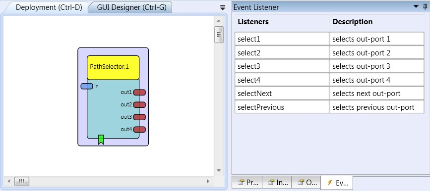

# Pathselector

Component Type: Processor (Subcategory: Signal Pathways)

The pathselector component allows routing of an incoming numerical signal between up to 4 output ports. The desired output port can be directly selected by a dedicated event listener port, or the signal can be switched to the next or previous output port. This component can be used to utilize one particular signal for different purposes, e.g. controlling different actuators within a single model by sequentially switching between them.

  
PathSelector plugin

## Input Port Description

- **in \[double\]:** The incoming signal to be routed.

## Output Port Description

- **out1 to out4:** Four output ports where the incoming signal can be routed to.

## Event Listener Description

- **select1 to select4:** An incoming event at these ports directly activates the associated output path (e.g. as an event comes in at select 3, the input signal will be routed to out3.
- **selectNext:** The next output port is selected for signal output. The maximum number of active ports is set via the active ports property. If the current number of active ports is already the maximum one, the select next event will wrap around the active port number and one port will be selected.
- **selectPrevious:** The previous output port is selected for signal output. If the current port is out1, the select previous event will switch to the port with the maximum number given by the active ports property.

## Properties

- **activePorts \[integer\]:** The maximum port number in use (can be 2 to 4).
