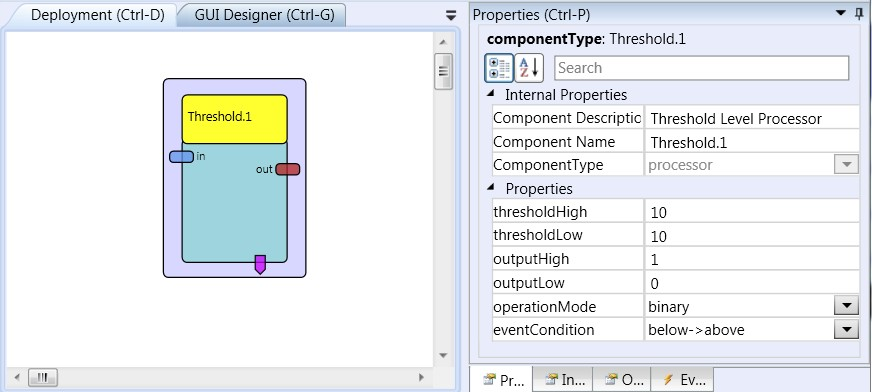

# Threshold

Component Type: Processor (Subcategory: Basic Math)

This component takes an input and compares it to a given threshold and generates an according output value dependent on the operation mode. The component allows three operation modes: binary, deadzone and cut off which are described in the property section. The component allows operating with a hysteresis by setting the thresholds for transition from below to above and vice versa differently. Transitions over the thresholds are always evaluated arithmetically thus a below threshold to above transition always happens when the new value is mathematically greater than the threshold while the last input was less than threshold. Respectively the transition from above to below happens when the last value was greater than the threshold value and the new value is less than it. This statement also holds for negative values in the threshold.  
The component provides the possibility to raise events on threshold transitions either on below to above, above to below or on both.

  
Threshold plugin

## Input Port Description

- **in \[double\]:** the input to be evaluated.

## Output Port Description

- **out\[double\]:** the value that the threshold passes on for the given input.

## Event Port Description

- **eventPosEdge:** This event port will trigger an event when the value crosses the thresholdHigh property from below.
- **eventNegEdge:** This event port will trigger an event when the value crosses the thresholdLow property from above.

## Properties

- **thresholdHigh \[double\]:** The threshold that is checked for transitions from below the threshold to above.
- **thresholdLow \[double\]:** The threshold that is checked for transitions from above the threshold to below. Setting it to the same value as threshold_high will remove the hysteresis from the threshold system.
- **outputHigh \[double\]:** The value to be sent to the output if the input is above the threshold in certain operation modes.
- **outputLow \[double\]:** The value to be sent to the output if the input is below the threshold in certain operation modes (see below).
- **operationMode \[integer\]:** There are three operation modes for the threshold component:
  - _binary:_ the output will only generate two different values, the value of output_high if the input is in the range above the threshold and the value of output_low if the input is below the threshold.
  - _cutoff:_ the input value will be passed through to the output as long as the value is below the threshold. If the input passes the threshold the output will take on the value set in output_high.v
  - _deadzone:_ the input value will be passed through to the output as long as the value is above the threshold. If the input falls below the threshold the output will take on the value set in output_low.
- **eventCondition \[integer\]:** This property declares on which types of transitions an event will be raised:
  - _Below->above:_ only transitions from below to above threshold raise events.
  - _Above->below:_ only transitions from above to below threshold raise events.
  - _Both:_ both types of transitions raise events.
