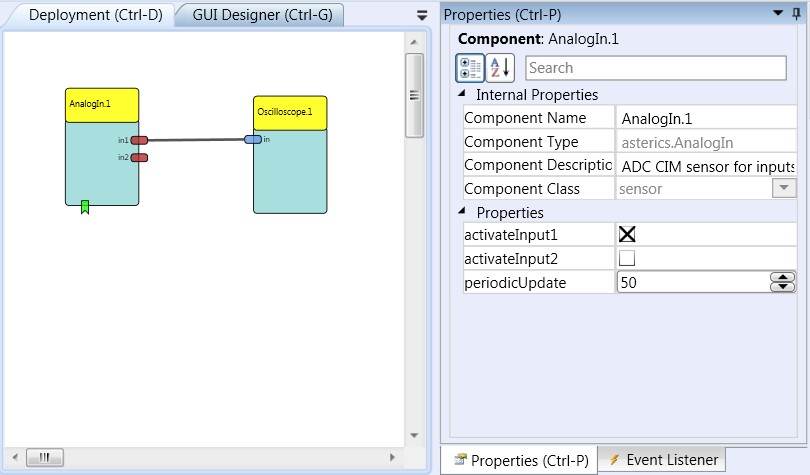

  
---
AnalogIn
---

# Analog In

### Component Type: Sensor (Subcategory: Generic Control Input)

The AnalogIn component is a sensor which is used in combination with the ADC CIM. The component provides two output ports which correlate to the inputs IN1 and IN2 of the CIM. The component can be set up to sample the inputs periodically or upon an incoming event. Both inputs can be used for voltage and resistance measurement.

  
AnalogIn plugin

## Requirements

This software component requires an ADC CIM (CIM ID: 0x0901) connected to a USB port.

## Output Port Description

*   **in1 to in2 \[integer\]:** Each of these output port corresponds to one input of the ADC CIM. The measured values are forwarded directly from the CIM thus corresponding to the description given in the CIM specification. Depending on the type of connected sensor the values either correspond to a voltage or a resistive value.

## Event Listener Description

*   **adcSampleTrigger:** An incoming event on this port will cause the ADC CIM to sample data on its inputs. This event will only take effect if the periodic\_update property is set to 0.

## Properties

*   **periodicUpdate \[integer\]:** This property defines the time between data sampling requests to the ADC CIM (in milliseconds). The software component will send requests to the CIM in the given intervals. Due to current limitations of the ADC CIM it is recommended to use time intervals not lower than 50 milliseconds (20 samples per second).
*   **activateInput1 to activateInput2 \[Boolean\]:** These properties correspond the CIM's ADC inputs IN1 to IN8, if the property is true, the corresponding output port of the software component will send the sampled data.
*   **uniqueId:** unique number of the CIM - if more than one CIMs of the same type are used. The module flashes a LED for identification when the ID is selected. **Supports value suggestions from ARE (dynamic property)**