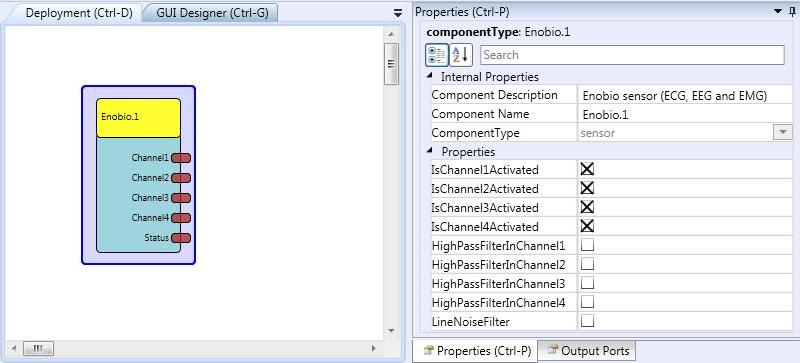
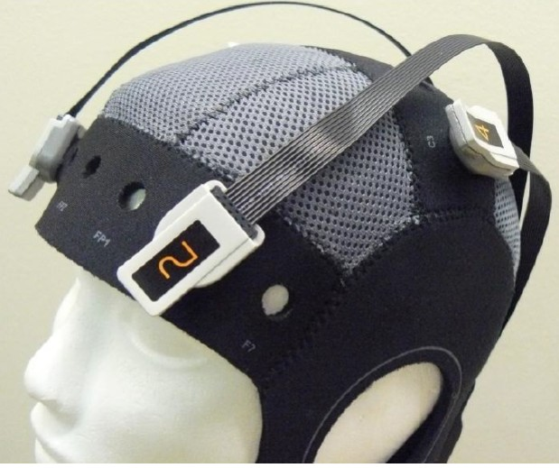

  
---
Enobio
---

# Enobio

### Component Type: Sensor (Subcategory: Bioelectric Measurement)

This component interfaces the Enobio sensor to the AsTeRICS system. It is in charge of driving the USB interface, commanding the proprietary protocol that Enobio uses, filtering the signal for removing the environmental noise and performing an automatic offset compensation for each channel in order to keep the electrophysiological signal correctly calibrated and avoid the effects that the skin contact may introduce in the signal. The component delivers the sampled signal in the Enobio electrodes through four output ports (one per channel). In addition, there is another output port which reports the calibration status of the channels and information regarding the sample loses due to environmental issues in the wireless link. The output ports (sampled data and status) deliver 250 values per second, which corresponds to the sample rate in the Enobio electrodes.

  
Enobio plugin

## Requirements

This software component requires an Enobio receiver connected to the platform, the Enobio device switched on and the electrodes correctly placed on the user.

  
Enobio device

## Output Port Description

*   **Channel1 to Channel4 \[integer\]:** Each output corresponds to the sampled data from its corresponding Enobio channel. The integer represents the microvolts of the electro-physiological signal read by Enobio. The data might be pre-processed according to the value of the properties of the component.
*   **Status \[integer\]:** This port provides information regarding both the calibration status of the four channels and the status of the wireless link. For every integer value that is available in the data output ports, another integer value is available in this port with the corresponding status information. The information is proprietary codified within a 16-bit integer. This includes information of calibration status of each channel and the status of the wireless link. This information would be kept away for the moment form the ARE programmers and provided upon request if necessary.

## Event Trigger Description

*   **externalSignalPosEdgeEvent:** This event is fired if the external signal toggles from low to high level.
*   **externalSignalNegEdgeEvent:** This event is fired if the external signal toggles from high to low level.

## Properties

*   **IsChannel1Activated to IsChannel4Activated \[Boolean\]:** If this property is set to true, the corresponding channel is calibrated, thus the raw data from this channel will be meaningful.
*   **HighPassFilterInChannel1 to HighPassFilterInChannel4 \[Boolean\]:** If this property is set to true, a high pass filter is applied to the data from the corresponding channel.
*   **LineNoiseFilter \[Boolean\]:** If this property is set to true, a 50 Hz band pass filter is applied to the data before it is passed to the output port. This filter is useful when the environmental electrical noise is present in the signal.