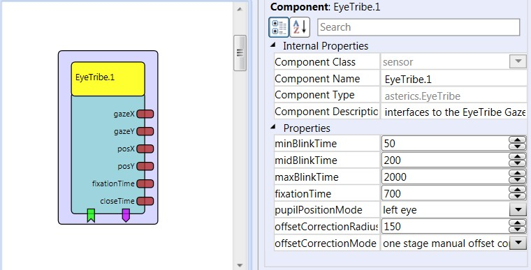

# Eyetribe

Component Type: Sensor (Subcategory: Computer Vision)

This component provides access to the raw gaze tracking data from the [EyeTribe][1] eye tracking device. The data includes the estimated gazepoint (x/y), the eye location (x/y), fixation time and eye close time. The plugin connects to a running EyeTribe server.

Eyetribe plugin

## Requirements

The Eyetribe tracker must be connected to an USB3.0 port and the Eyetribe server software must be running.

Eyetribe hardware

## Output Port Description

*   **gazex \[integer\]:** The x-coordinate of the estimated gazepoint on the computer screen (in pixels)
*   **gazey \[integer\]:** The y-coordinate of the estimated gazepoint on the computer screen (in pixels)
*   **posx \[integer\]:** The x-coordinate of the eye pupil(s) - left / right / both pupils can be selected via property
*   **posy \[integer\]:** The y-coordinate of the eye pupil(s) - left / right / both pupils can be selected via property
*   **fixationTime \[integer\]:** The time period for fixation of a particular spot on the screen
*   **closeTime \[integer\]:** The time period for closing both eyes (or eye tracking signal lost)

## Event Listener Description

*   **startCalibration:** if this event is triggered, calibration procedure for the Eyetracker is started.
*   **offsetCorrection:** this event is useful when a drift of the cursor position has occured. When the event is triggered, the plugin stops the output of x/y coordinates for several seconds, where the user has time to fix the exact cursor position with the eyes. (see description below).
*   **removeLastOffsetCorrection** when this event is triggered, the last offset correction point will be removed - useful if the offset correction did not work as intended.

## Event Trigger Description

*   **blink:** triggered if the eye detection is lost for a timespan bigger than minBlinkTime and lower than midBlinkTime. This can be used for a single eye-blink detection.
*   **longBlink:** triggered if the blob detection is lost for a timespan bigger than midBlinkTime and lower than maxBlinkTime. This can be used for a long eye-blink detection.
*   **fixation:** triggered if the user looks at a particular location on the screen for longer than defined in via the fixationTime property.
*   **fixationEnd:** triggered if the user looks stops looking at a particular location (which triggered a fixation event).

## Properties

*   **minBlinkTime \[integer\]:** the minimum time for a short blink to be detected (a short blink is detected if the blink time is bigger than minBlinkTime and lower than midBlinkTime.)
*   **midBlinkTime \[integer\]:** the time for seperating short blinks from long blinks.
*   **maxBlinkTime \[integer\]:** the maximum time for a short blink to be detected (a long blink is detected if the blink time is bigger than midBlinkTime and lower than maxBlinkTime..
*   **fixationTime \[integer\]:** the minimum time for triggereing a fixation event when the user looks at a particular spot on the screen
*   **pupilPositionMode \[combobox\]:** selects the mode for calculation of the eye position output port values. (left eye / right eye or an average of both eyes)
*   **offsetCorrectionRadius \[integer\]:** defines the distance to an offset correction point where this offset correction points starts to influece the eye coordinates (see description below)
*   **offsetCorrectionMode \[combobox\]:** selects the mode for the offset correction measurement. (manual or automatic mode, see above description)

### Calibration and Offset Correction

*   A sucessful gaze estimation needs prior calibration. This should be done using the application/GUI provided by the EyeTribe software. However, a calibration can also be initiated using the provided **startCalibration** EventListener port (see below). When starting the calibration process using this event, the mouse cursor is positioned to 9 screen locations, starting at the left upper corner and iterating via middle and right position through 3 rows until the right bottom corner is reached. During calibration, follow the cursor with the eyes (reducing head movements to a minimum). For each calibration position, an acoustic signal indicates the time when the samples are taken. When the calibration process is finished, the plugin continues sending the measurement data from it's output ports.
*   The **offset correction** event listener port allows setting so called "offset correction points" at desired screen locations. This is possible during the normal operation of the eye tracking. This is useful when certain locations on the screen cannot be reached because of a calibration problem but a new calibraiton is either not desired or not successful / precise enough. The goal of the offset correction is to reduce the error between the real gaze point and the estimated (weak) gaze point where usually the cursor is positioned, by adding a small offset value. After starting the offset correction (which is indicated by an acoustic signal) look at the intended spot on the screen. After 1 second, another acoustic signal indicates that the coordinates have been saved. Now look at the mouse cursor (the weak gaze point which shall be corrected). The next step differs according to the selected offset correction mode (which can be chosen via the **offsetCorrectionMode** property:
    
    *   manual offset correction: try to follow the cursor with the eyes. It should move slowly towards the original gaze point, correcting the error. This manual calibration phase takes about 4 seconds.
    *   automatic offset correction: look at the cursor. After 1 second, the offest is measured.
    
    After the offset correction has been performed, the given offset value is stored into an internal list. As soon as the estimated gaze point enters an area around the offset correction point (the area size is defined via the property offsetCorrectionRadius), an appropriate fraction of the offset value is added to the estimated gaze point coordinates.  
    Here, linear approximation is used, so that looking at the original (weak) gaze estimation point will add the full offest value, resulting the corrected gaze estimation point.

[1]: https://theeyetribe.com/