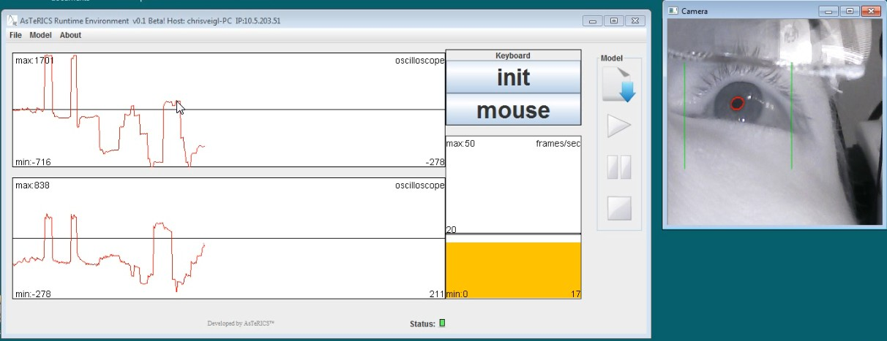
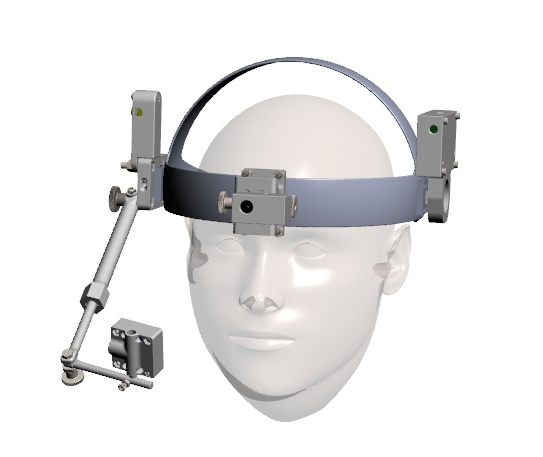

# Eyetracker

### Component Type: Sensor (Subcategory: Computer Vision)

This component provides different computer vision tracking algorithms which can be selected via the "trackingMode" property. The available modes include "blob-tracking", "calibrated eye-tracking" and "calibrated eye-tracking with head pose estimation". The two eye-tracking modes deliver estimations of the x/y-positions where the user is looking on the computer screen which can be used for cursor control (gaze estimation).

### Plugin modes

- **only blob tracking** In this mode, the plugin just outputs the x/y coordinates of a round surface detected in the live camera images. No calibration procedure is needed. The plugins starts immediately with the coordinate output at the ports "x" and "y". A possible application for this mode is tracking of a round marker which could be placed anywhere on the body.
- **calibrated eye tracking** In this mode, the plugin expects close-up images of an eye, recorded by a head-mounted setup. The suggested hardware configuration is the AsTeRICS headmounted SVM system (see image below). The eye-pupil location is determined and mapped to an estimated position at the computer screen where the person is looking at. For this mode, the plugins needs to be calibrated. First, a rectangular region of interest (ROI) has to be selected by clicking into the live camera image while holding the CTRL/STRG key. The ROI should cover the area where the eyeball is moving when the user is looking in different directions. Then, the calibration sequence can be started by sending an event to the "calibrate" event listener port. During calibration, the cursor is moved to several locations on the screen and the user is supposed to look at these positions without moving the head. The changing of the cursor position is indicated with an acoustic signal. Calibration succeeds if all calibration location can be recorded without excessively distorted values. If the calibration cannot be accomplished successfully, an acoustic signal is emitted and the Eyetracker plugin does not start to put out x/y data. In this case the calibration procedure has to be repeated. The coordinate-output of the eye tracking is only working correctly if no head movements occur. Any head movement will compromise the correctness of the x/y estimation for the cursor position..
- **calibrated eye tracking with head pose estimation** This mode is an extension of the "calibrated eye tracking" mode. The calibration has to be performed as above. Additionally to the head-mounted camera, an external LED-frame mounted on the computer monitor is used to minimize the negative effects of head movements to the tracking accuracy. Please note that this mode needs the head-mounted SVM device plus the external Led-Frame.

  
Eyetracker in operation (calibrated eyetracking mode)

## Requirements

A camera has to be available in the operating system, to detect round blobs or the eye-pupil position. Depending on the mode (if head pose estimation is selected), a head mounted camera which films a close-up of the eye and an external LED-mount are needed.

  
head mounted SVM device

## Input Port Description

- **pt1x - pt4x \[integer\]:**
- **pt1y - pt4y \[integer\]:** These 8 input ports can be connected to the corresponding output ports of the Sensorboard plugin. The Sensorboard delivers the location of 4 IR-led tracking points in the field-of-view of the IR-object-tracking camera of the headmounted SVM. This information can be used to compensate the head movement to increase gaze estimation stability. The 8 input ports have to be synchronized (turn the synchronized-property on for every input port). **These 8 input ports support synchronization**

## Output Port Description

- **x \[integer\]:** The x-coordinate delivered by the tracking algorithm. The meaning of this value depends on the selected mode.
- **y \[integer\]:** The y-coordinate delivered by the tracking algorithm. The meaning of this value depends on the selected mode.

## Event Listener Description

- **calibrate:** if this event is triggered, calibration procedure for the Eyetracker is started (this is not relevant for the mode "only blob tracking").
- **offsetCorrection:** this event is useful for eyetracking mode, when a drift of the cursor position has occured. When the event is triggered, the plugin stops the output of x/y coordinates for two seconds, where the user has time to fix the exact cursor position with the eyes. A new offset will be calculated to match the cursor position after the 2 seconds pause.
- **showCameraSettings** an incoming event displays the settings window for the camera device, where parameters like image brightness or contrast can be adjusted.
- **togglePoseInfoWindow** an incoming event displays the pose info window, where the current location of the 4 IR tracking points for head-pose compensation can be seen. For a normal head orientation these 4 points should be centered in the middle of the window (change the angle of the frontal camera to adjust the position of the yellow dots).
- **startEvaluation** an incoming event displays the accuracy evaluation window and starts evaluation. When the user follows the cross to 9 positions in the window, the x/y coordinates of the cursor are stored to a file in the ARE folder which can then be used to calculate and compare the gaze accuracy.
- **saveProfile** an incoming event saves the camera settings to a file of the given name (property cameraProfile). Use with caution - a saved settings-profile does only work with the same camera which was used to save the settings.

## Event Trigger Description

- **blinkDetected:** triggered if the blob detection is lost for a timespan bigger than minBlinkDuration and lower than maxBlinkDuration. This can be used for a single eye-blink detection.
- **longBlinkDetected:** triggered if the blob detection is lost for a timespan bigger than maxBlinkDuration. This can be used for a long eye-blink detection.

## Properties

- **cameraSelection \[string, combobox selection\]:** using this property, the utilized camera can be chosen. Possible values range from �first camera� to �fith camera�. If only one camera is available in the system, �first camera� shall be chosen.
- **cameraResolution \[string, combobox selection\]:** This selection box provides several standard camera resolutions. Changing the resolution affects accuracy and performance (CPU load of the runtime system). Provided selections include �160x120�, �320x240�, �640x480�, �800x600�, �1024x768� and �1600x1200�. If the selectied resolution cannot be delivered by the image acquisition device, the next matching resolution is chosen by the plugin.
- **cameraProfile \[string\]** a filename for the camera settings profile to be saved (property cameraProfile). Use with caution - a saved settings-profile does only work with the same camera which was used to save the settings.
- **cameraDisplayUpdate \[integer\]:** This property allows to select the update rate for the camera display in milliseconds. If �0� milliseconds is chosen, no window for the live-video will be displayed. If �100� is chosen, the live image window will be updated 10 times a second. This property does not influence the frame rate of the camera nor the processing interval for new camera frames, only the display in the GUI is adjusted.
- **tracking mode \[string, combobox selection\]:** The selection of the plugin's mode of operation ("only blob tracking", "calibrated eye tracking", or "calibrated eye tracking with head pose estimation")
- **xMin \[integer\]:** the minimum value for the x-coordinate output
- **xMax \[integer\]:** the maximum value for the x-coordinate output. If "0" is selected, the plugins auto-detects the screen resolution and uses the X-Size of the computer screen.
- **yMin \[integer\]:** the minimum value for the y-coordinate output
- **yMax \[integer\]:** the maximum value for the y-coordinate output. If "0" is selected, the plugins auto-detects the screen resolution and uses the Y-Size of the computer screen.
- **calibrationStepsX \[integer\]:** the number of rows for generating calibration positions
- **calibrationStepsY \[integer\]:** the number of columns for generating calibration positions. For example: if 4 x-steps and 3 y-steps are chosen, the user has to look at 12 cursor positions during the calibration phase. More positions increase the gaze-tracking accuracy but result in a longer calibration phase.
- **averaging \[integer\]:** the length of the averaging window for smoothening the ouput values.
- **screenSize \[double\]:** the diameter of the computer screen (important if head pose correction is used)
- **minBlinkDuration \[integer\]:** the minimum time for a short blink to be detected (a short blink is detected if the blink time is bigger than minBlinkDuration and lower than maxBlinkDuration.
- **maxBlinkDuration \[integer\]:** the maximum time for a short blink to be detected (a long blink is detected if the blink time is bigger than maxBlinkDuration).
