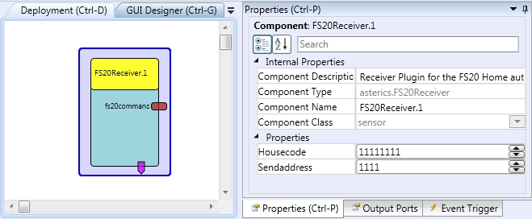
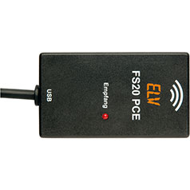

# FS20 Receiver

Component Type: Sensor (Subcategory: Home Control)

The FS20Receiver receives commands of the home automation system FS20 for ELV Electronics. Depending on the received commands, events will be fired.

FS20 Receiver Plugin

## Requirements

This component requires the [FS20 PCE Receiver][1] connected to a USB port.

FS20 PCE Receiver

## Supported OSes

Windows (x86,x64), Linux (x86, x64, arm(Raspberry Pi)), Mac OSX(x86, x64)

## Notes on Linux platform

If you installed AsTeRICS as package, all necessary permission already set. If you built AsTeRICS on your own, please type following command on a terminal window:  
  
_sudo echo 'ATTRS{idProduct}=="e015", ATTRS{idVendor}=="18ef", MODE="0660", GROUP="plugdev"' > /etc/udev/rules.d/50-asterics-fs20.rules_  
  
Onw additional command is necessary if you work on ARM based platforms (RaspberryPi, BananaPi,...):  
  
_sudo ln -sf /lib/arm-linux-gnueabihf/libudev.so.1 /lib/arm-linux-gnueabihf/libudev.so.0_  
  
Afterwards, unplug and plug in the FS20 device and restart AsTeRICS.

## Output Port Description

*   **fs20command \[string\]:** The received FS20 command will be send out of the plugin. The data has the following format: housecode\_sendaddress\_command, e.g. 11111111\_3343\_17

## Event Trigger Description

Each received command triggers an event, being mapped to this command. The following table will describe this events:

Command Mapping

Event

Command

Off

0

Level1

1

Level2

2

Level3

3

Level4

4

Level5

5

Level6

6

Level7

7

Level8

8

Level9

9

Level10

10

Level11

11

Level12

12

Level13

13

Level14

14

Level15

15

Level16

16

OnOldLevel

17

Toggle

18

Dim Up

19

Dim Down

20

Dim Up and Down

21

Program internal timer

22

Off for timer then old brightness level

24

On for timer then off

25

On old brightness level for timer then off

26

On for timer then old brightness level

30

On for old level then previous state

31

## Properties

*   **housecode \[integer\]** The housecode, the system should react on. The housecode has 8 digits, each from 1 to 4. This property influences the event triggers, but not the _fs20command_ output port.
*   **sendaddress \[integer\]** The sendaddress, the system should react on. The sendaddress has 4 digits, each from 1 to 4. This property influences the event triggers, but not the _fs20command_ output port.

[1]: http://www.elv.de/empfaenger-fs20-funkschaltsystem.html