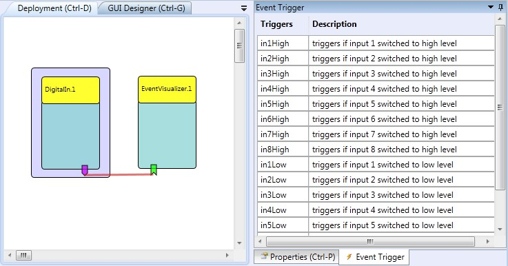
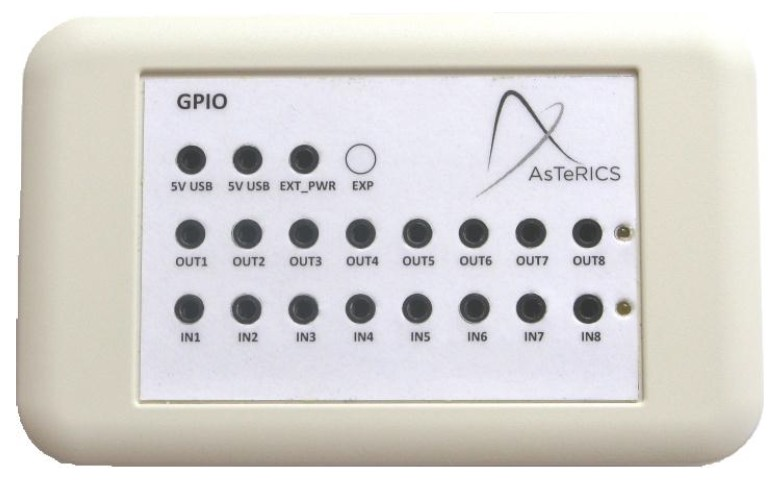

# Legacy Digital In

Component Type: Sensor (Subcategory: Generic Control Input)

The LegacyDigitalIn component provides an interface to read the digital inputs of the legacy GPIO CIM (CIM Id: 0x0201). On state changes of the connected signals (transitions to high or low level), the component generates corresponding trigger-events.

LegacyDigitalIn plugin

## Requirements

This component requires the legacy GPIO CIM (CIM Id: 0x0201) connected to an USB port.

GPIO CIM

## Event Trigger Description

- **in1High to in8High:** Each of these event ports is linked to one input port, if the device connection to this input port delivers a signal which changes to high level, an event will be raised on the corresponding port.
- **in1Low to in8Low:** Each of these event ports is linked to one input port, if the device connection to this input port delivers a signal which changes to low level, an event will be raised on the corresponding port.

## Properties

- **activateEventIn1 to activateEventIn8 \[Boolean\]:** These properties declare for each port whether or not a signal transition on the actual input port should result in an event being triggered in the ARE. If a property is set true for one input, it will raise events on signal transitions, if it is set to false it will not.
- **periodicUpdate:** Period in milliseconds for update messages about state of device inputs. If the property is set to zero, the plugin will receive messages from the CIM on signal transitions, if the property is non-zero, the CIM will send status messages in the defined intervals without extra event messages on signal changes. Both modes will have the same effect on the software plugin, it will raise events on its trigger ports.
