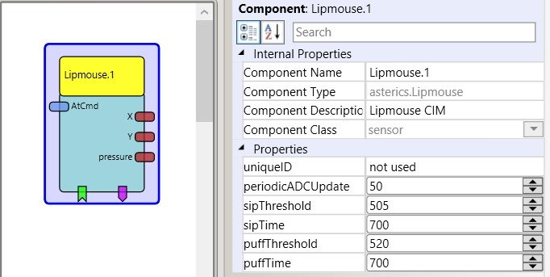
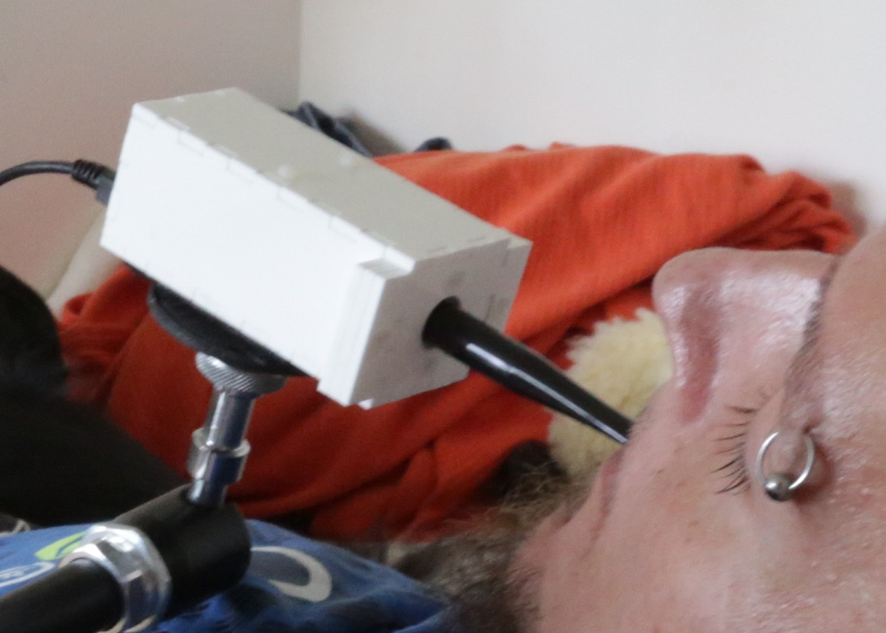

# Lipmouse

Component Type: Sensor (Subcategory:Sensor Modules)

This component provides signals from the [FLipmouse][1] module, which is a universal hardware module for alternative computer control and environnmental control. The FLipMouse allows computer control via a mouthpiece (i.e. via lips or small finger movements), and can create USB HID input for computers or smart phones (mouse-, keyboard- and joystick emulation). The FlipMouse also includes an infrared receiver and transmitter so that it can record and replay infrared codes of different consumer electronic devices. A user interacts with the FLpiMouse mouthpiece: left/right, up/down and sip/puff. Alternatively, HID actions and IR functions can be controlled via AT-commands (see below). The FLipmouse can be adjusted to work with very low forces so that it can be used by persons with severly reduced motor capabilites.

The Lipmouse sensor plugin

## Requirements

The FLipmouse module must be connected to a USB port. Firmware for the FLipmouse sensor can be found in [Github][2] repository. The free Arduino IDE + Teensyduino can be used to update the firmware of the FLipmouse module.

FLipmouse application

## Input Port Description

*   **AtCmd \[string\]:** many functions of the FLipMouse can be controlled via AT commands, i.e. commands strings which start with 'AT' and are supported by the FLipMouse module. For a comprehensive list of supported commands see: [here][3]. The command strings sent to this input port do not need to start with 'AT' and do not need to end with a CR/LF character. For example: if you want to move the mouse 20 steps in x-direction, send 'MX 20' to the input port.

## Output Port Description

*   **X \[integer\]:** the force applied to the FLipmouse mouthpiece in x-direction
*   **Y \[integer\]:** the force applied to the FLipmouse mouthpiece in y-direction
*   **pressure \[integer\]:** the pressure value applied to the sip/puff - sensor

## Event Listener Description

*   **calibration:** if this event is received, the x/y force value is set to 0 (removing any drift of the sensor values)
*   **setLed1:** if this event is received, Led1 will be turned on
*   **clearLed1:** if this event is received, Led1 will be turned off
*   **setLed2:** if this event is received, Led2 will be turned on
*   **clearLed2:** if this event is received, Led2 will be turned off
*   **setLed3:** if this event is received, Led3 will be turned on
*   **clearLed3:** if this event is received, Led3 will be turned off

## Event Triggerer Description

*   **sip:** will be triggered when pressure decreases under the selected sip treshold and increses back before the selected sipTime has passed
*   **longSip:** will be triggered when pressure decreases under the selected sip treshold and increases back after the selected sipTime has passed
*   **sipStart:** will be triggered at the moment when pressure decreases under the selected sip treshold
*   **sipEnd:** will be triggered at the moment when pressure increases above the selected sip treshold
*   **puff:** will be triggered when pressure increases above the selected puff treshold and decreases back before the selected puffTime has passed
*   **longPuff:** will be triggered when pressure increases above the selected puff treshold and decreases back after the selected puffTime has passed
*   **puffStart:** will be triggered at the moment when pressure increases above the selected puff treshold
*   **puffEnd:** will be triggered at the moment when pressure decreases under the selected puff treshold
*   **button1Pressed:** will be triggered when button1 of the FLipmouse is pressed
*   **button1Released:** will be triggered when button1 of the FLipmouse is released
*   **button2Pressed:** will be triggered when button2 of the FLipmouse is pressed
*   **button2Released:** will be triggered when button2 of the FLipmouse is released
*   **button3Pressed:** will be triggered when button3 of the FLipmouse is pressed
*   **button3Released:** will be triggered when button3 of the FLipmouse is released

## Properties

*   **uniqueID \[integer\]:** a unique identifier, useful if more then one lipmouse modules are used (dynamic property).
*   **periodicADCUpdate \[integer\]:** the update rate for force and pressure values in milliseconds.
*   **sipThreshold \[integer\]:** threshold value for sip actions.
*   **sipTime \[integer\]:** threshold time for sip/longSip events.
*   **puffThreshold \[integer\]:** threshold value for puff actions.
*   **puffTime \[integer\]:** threshold time for puff/longPuff events.
*   **enableStandaloneFunctions \[boolean\]:** if enabled, the FLipMouse will perform it's normal functions as defined in the FlipMouseGUI settings manager; if disabled, the FlipMouse will only act as sensor for the AsTeRICS plugin.

[1]: https://github.com/asterics/FLipMouse
[2]: https://github.com/asterics/FLipMouse
[3]: https://github.com/asterics/FLipMouse/blob/master/FLipWare/commands.h