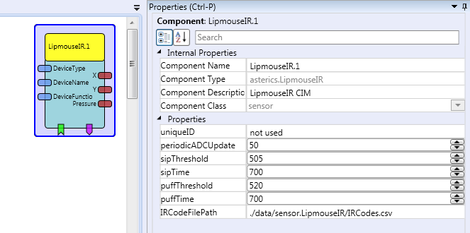

# LipmouseIR

Component Type: Sensor (Subcategory:Sensor Modules)

This component provides signals from the Lipmouse module, which allows computer control via a mouthpiece. The user can create input signals with 3 degrees of freedom by interacting with the mouthpiece: left/right, up/down and sip/puff. The horizontal and vertical movements are measured via force sensors inside the lipmouse module. The sip/puff actions are measured via a pressure sensor. The lipmouse can be adjusted to very low force that it can be used by persons with severly reduced motor capabilites (e.g. late stage musculuar dystrophy or quadraplegia up to C1/C2 lesions). Additionally the Lipmouse has an infrared interface which enables it to control electronic devices.  
Through a receiver it is possible to record commands from existing remote controls and store the codes to a database. When needed, the IR signal is reconstructed and transmitted to the device to be controlled.

The LipmouseIR sensor plugin

## Requirements

The LipmouseIR module must be connected to a USB port. Firmware for the lipmouseIR sensor can be found in the folder CIMs/Lipmouse\_CIM. The free "teensy loader" tool can be used to update the firmware of the lipmouseIR module. Detailed design documentation will be provided in the future.

## Input Port Description

*   **DeviceType \[string\]:** Type of the device to be controlled via IR (e.g.: TV)
*   **DeviceName \[string\]:** Name of the device to be controlled via IR (e.g.: Sony, Samsung, etc.)
*   **DeviceFunction \[string\]:** Name of function of the device (e.g.: On, Off, VolumeUp, etc.)

## Output Port Description

*   **X \[integer\]:** the force applied to the Lipmouse mouthpiece in x-direction
*   **Y \[integer\]:** the force applied to the Lipmouse mouthpiece in y-direction
*   **pressure \[integer\]:** the pressure value applied to the sip/puff - sensor

## Event Listener Description

*   **SendIRCode:** Send an IR Code to the Lipmouse
*   **RecordIRCode:** Record an IR Code through the Lipmouse
*   **calibration:** if this event is received, the x/y force value is set to 0 (removing any drift of the sensor values)
*   **setLed1:** if this event is received, Led1 will be turned on
*   **clearLed1:** if this event is received, Led1 will be turned off
*   **setLed2:** if this event is received, Led2 will be turned on
*   **clearLed2:** if this event is received, Led2 will be turned off
*   **setLed3:** if this event is received, Led3 will be turned on
*   **clearLed3:** if this event is received, Led3 will be turned off

## Event Triggerer Description

*   **StartRecord:** will be triggered when Lipmouse is recording
*   **StopRecord:** will be triggered when Lipmouse has finished recording
*   **sip:** will be triggered when pressure decreases under the selected sip treshold and increses back before the selected sipTime has passed
*   **longSip:** will be triggered when pressure decreases under the selected sip treshold and increases back after the selected sipTime has passed
*   **sipStart:** will be triggered at the moment when pressure decreases under the selected sip treshold
*   **sipEnd:** will be triggered at the moment when pressure increases above the selected sip treshold
*   **puff:** will be triggered when pressure increases above the selected puff treshold and decreases back before the selected puffTime has passed
*   **longPuff:** will be triggered when pressure increases above the selected puff treshold and decreases back after the selected puffTime has passed
*   **puffStart:** will be triggered at the moment when pressure increases above the selected puff treshold
*   **puffEnd:** will be triggered at the moment when pressure decreases under the selected puff treshold
*   **button1Pressed:** will be triggered when button1 of the lipmouse is pressed
*   **button1Released:** will be triggered when button1 of the lipmouse is released
*   **button2Pressed:** will be triggered when button2 of the lipmouse is pressed
*   **button2Released:** will be triggered when button2 of the lipmouse is released
*   **button3Pressed:** will be triggered when button3 of the lipmouse is pressed
*   **button3Released:** will be triggered when button3 of the lipmouse is released

## Properties

*   **uniqueID \[integer\]:** a unique identifier, useful if more then one lipmouse modules are used (dynamic property).
*   **periodicADCUpdate \[integer\]:** the update rate for force and pressure values in milliseconds.
*   **sipThreshold \[integer\]:** threshold value for sip actions.
*   **sipTime \[integer\]:** threshold time for sip/longSip events.
*   **puffThreshold \[integer\]:** threshold value for puff actions.
*   **puffTime \[integer\]:** threshold time for puff/longPuff events.
*   **IRCodeFilePath \[string\]:** Filepath to the file, where the IR Codes are stored.

## IR Code Database

The database which contains the IR codes as well as the information about the type and name of the device and the specific function is a comma separated value file. The first value is the type, the second one is the name and the third one is the function. The following 512 values are the IR code. This database is automatically generated and maintained if new IR codes are recorded with the Lipmouse with IR functions.