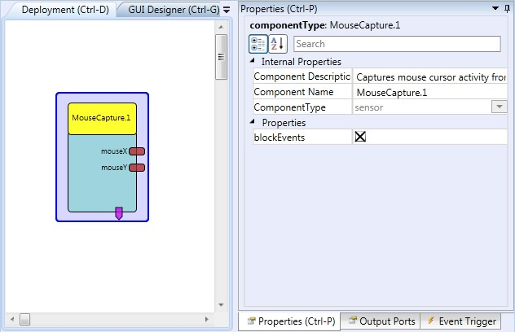

# Mouse Capture

### Component Type: Sensor (Subcategory: Standard Input Devices)

This component provides access to mouse input activities of connected a standard mouse, like mouse x/y movement or button press/release activities. Mouse wheel and third mouse button are supported.

  
MouseCapture plugin

## Requirements

A mouse or mouse-equivalent must be connected to the computer/personal platform.

## Output Port Description

- **mouseX \[integer\]:** This port provides current absolute mouse X-position or relative mouse X-movement as integer value (depending on the mode of operation).
- **mouseY \[integer\]:** This port provides current absolute mouse Y-position or relative mouse Y-movement as integer value (depending on the mode of operation).

## Event Trigger Description

- **leftButtonPressed:** This port fires an event as the left mouse button is pressed.
- **leftButtonReleased:** This port fires an event as the left mouse button is released.
- **rightButtonPressed:** This port fires an event as the right mouse button is pressed.
- **rightButtonReleased:** This port fires an event as the right mouse button is released.
- **middleButtonPressed:** This port fires an event as the middle mouse button is pressed.
- **middleButtonReleased:** This port fires an event as the middle mouse button is released.
- **wheelUp:** This port fires an event as the mouse wheel is turned one step away from the user.
- **wheelDown:** This port fires an event as the mouse wheel is turned one step towards the user.

## Properties

- **blockEvents \[boolean\]:** This property defines the mode of operation of the mousehook component. If this property is set to true, no mouse activities will be routed to the operating system - they will not be processed by other applications, the mouse cursor will not move and no clicks will be actually performed by the operation system. This can be useful if the mouse activity shall be transferred e.g. from the AsTeRICS personal platform to another system (via the HID actuator) or the mouse should be trapped to control a particular GUI or menu structure. In this case, the mouse component outputs only relative mouse movements in X and Y axis at the corresponding output ports. If the property value is set to false, mouse activities will be passed back to the operating system and will be processed as usual. In this case, the mousehook component provides the absolute mouse positions at the component?s output ports.
