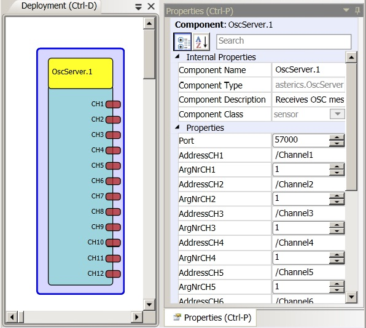

# Osc Server

Component Type: Sensor (Subcategory: Communication)

The OscServer component enables the ARE to receive messages using the OpenSoundControl (OSC) protocol. The OscServer can receive various OSC data messages which can be divided in the individual data segments and forwarded to the output ports. The properties are used for the segmentation of the individual information segments of a whole OSC message. This plugin utilizes the NetUtil java library (http://www.sciss.de/netutil/) for the OSC implementation, it is (C)opyrighted 2004-2011 by Hanns Holger Rutz and released under the GNU Lesser General Public License.

OscServer plugin

## Requirements

*   Any OSC client software which sends data to the server e.g. ARE OscOutClient Plugin, various OSC Apps for Android and various PC software.
*   Check your firewall configuration and network settings to ensure that OSC messages are not blocked.
*   Exact knowledge about the structure of the OSC message, to determine the OSC message structure refere to the OSC client documentation or utilze a neworksniffer e.g. Wireshark (www.wireshark.org)

## Functional Principle

Symbolic OSC Message

Each time the OscServer Plugin receives a OSC message it decompose it according to the plugin properties (AddressCH\[n\], ArgNrCH\[n\]) and forward it to the output ports. The OscServer is able to receive OSC messages with arguments of the type float and string. The OSC datatype float is typcased to the ARE type double.

## Output Port Description

*   **out 1-8 \[double\]:** Forward data form the OSC message.
*   **out 9-12 \[string\]:** Forward strings from the OSC message

## Properties

*   **Port \[integer\]:** This value specifies the OscServer port.
*   **AddressCH\[n\] \[string\]:** This value specifies the OSC input address e.g. "/path/to/sensor/accxyz".
*   **ArgNrCH\[n\] \[integer\]:** The Argument Number defines which single argument of an entire message is picked out and forwarded to the output. The first argument of an OSC message begins with the index value zero, e.g. the first argument has the index 0, the second the index 1 and so on.

## Referred Plugins

*   OscOutClient
*   OpenVibe
*   OscGestureFollower