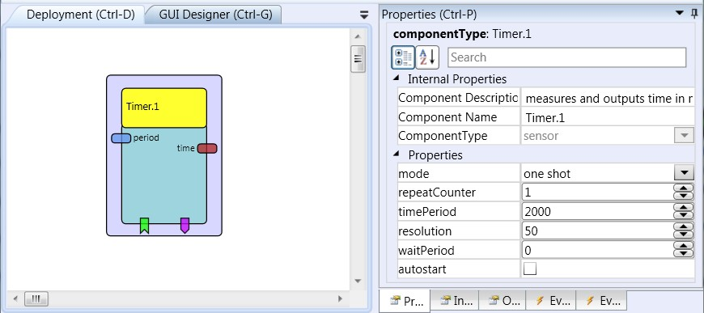

##

## Timer

# Timer

### Component Type: Sensor (Subcategory: Simulation)

The timer component can measure time in milliseconds, provide current time on an output port and trigger events when a specified time period has passed. It can be used to influence other features (e.g. to provide acceleration) or to enable dwell selection, for example clicking when a certain time has passed.

  
Timer plugin

## Input Port Description

- **period \[integer\]:** The number of milliseconds the timer period property is set to.

## Output Port Description

- **time \[integer\]:** The number of milliseconds which have passed since the timer has been started.

## Event Listener Description

- **start:** An incoming event starts the timer.
- **stop:** An incoming event stops the timer (pause, the current time value is not reset to 0).
- **reset:** An incoming event resets the time value to 0 (but does not stop the timer).

## Event Trigger Description

- **periodFinished:** This event is triggered when the given time has passed.

## Properties

- **mode \[integer\]:** This property selects one of several possible modes of operation of the timer:
  - _"one shot":_ The timer runs once from 0 to the specified time, and then stops.
  - _"repeat n times":_ The timer completes the time period several times (the number is selected with the repeat counter property).
  - _"endless loop":_ the timer completes the time period until it is stopped by an event at the stop listener port.
  - _"once and continue time output":_ The time period is completed once, the timer is not stopped but continues to send the last time value (this is useful to generate increasing values with persisting maximum value, e.g. for utilization as accelerated speed value).
  - _"measure time between start and stop":_ The timer sends the time passed from start to stop events to the output port (when stop was received).
- **repeatCounter \[integer\]:** The number of periods to finish for the "repeat n times " mode.
- **timePeriod (ms) \[integer\]:** The time period covered by this counter in milliseconds.
- **resolution (ms) \[integer\]:** The update rate of the timer in milliseconds. This value defines how often the current time value is updated and sent to the output port. It thereby defines the accuracy for the timer.
- **waitPeriod (ms) \[integer\]:** This value specifies how long the timer is bypassed before it actually starts (after receiving a start event).
- **autostart \[boolean\]:** This property defines if the timer will be started automatically together with the model (true) or if it will be started by an event (false).
